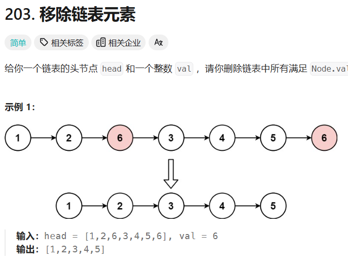
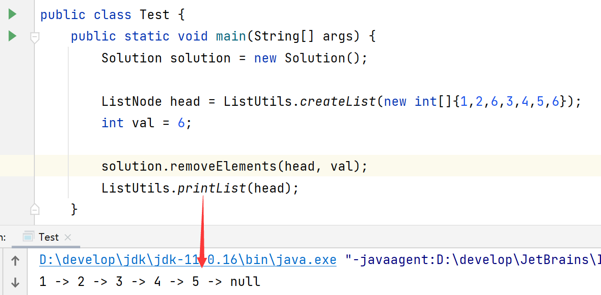
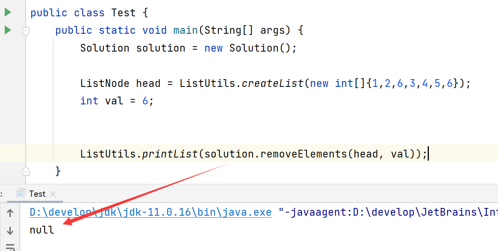
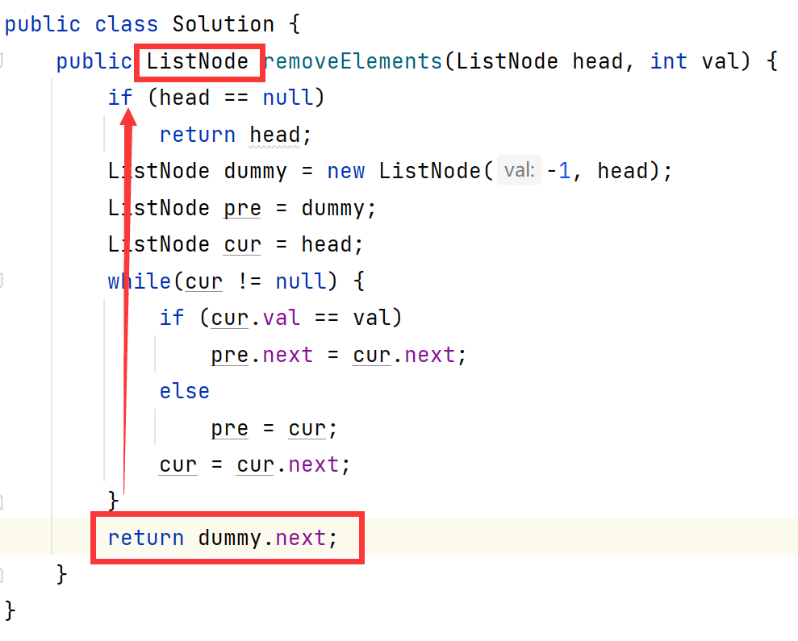
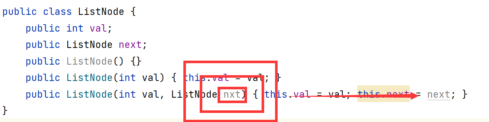
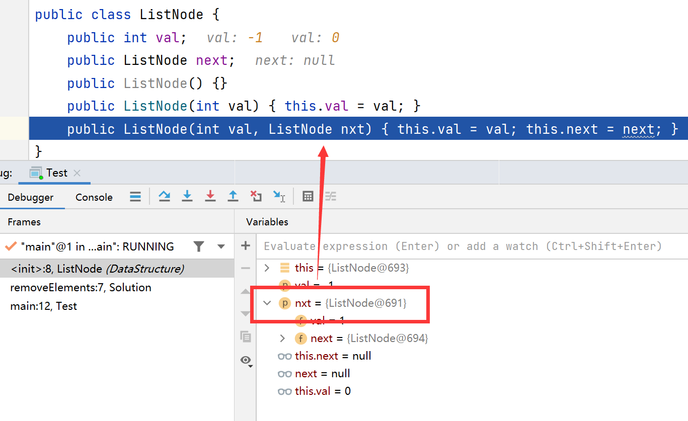

# 背景
目前LeetCode已经刷了不少题目，开始关心起这样一个问题：**面试时候手撕代码怎么撕？口述、txt还是牛客平台？笔试是点入各家的链接吗？跟力扣的代码平台有什么很大区别吗？**

## 手撕代码

咨询身边好友得到的回复是：区别很大，不能Debug。

- **牛客平台**：哔哩哔哩

- **本地环境**：京东（提供题目描述，自己用开发环境写代码，没有类名，函数名、参数返回值）

- **第三方平台**：字节用飞书面试，给代码沙盒环境（极少量类似vc++能提供的那种提示）
- **手写**

# 乌龙

我尝试了**VSCode + LeetCode**插件，不习惯VSCode的提示和运行方式，毕竟只是编辑器，显得不是那么专业和趁手，于是转向挚爱的IDEA。

## 以LeetCode 203.移除链表元素为例

## 我在IDEA中编写了以下类

- Solution
- Test
  - DataStruct.ListNode
  - Utils.ListUtils：用于输入样例数组转链表、打印链表方便调试

## 遇到的问题

理应正常，实际正常的输出如下：

理应正常，实际不正常的输出如下：

按照`Solution#removeElements`的返回结果不应该有错：

## 发现的乌龙Bug

乌龙在于一个有参构造方法的参数名笔误了！！！

# 总结

1. 学以致用，善用`Junit`。不要自己写Test，怪麻烦的。
2. 即使你不会`Junit`也要会Debug，这次的bug就是通过`Step Into (F7)` 看到了控制台才发现的。

