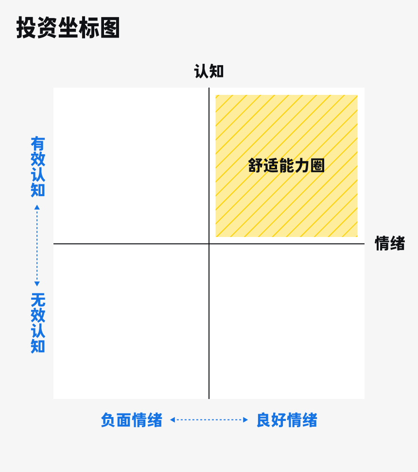

# 02 投资坐标图：一张防止迷路的指南图

大家好，我是玖洲。

在上期节目中，我们提到，投资是通过一个又一个决策，在高度不确定的环境中提高投资回报；我们还解密了投资机构会通过「研究」、「交易」和「风险控制」这三个系统来掌握相对的确定性。

不过研究机构使用的系统有点复杂。我想提供一个普通人也可以使用的高效实用的框架。请准备好笔和纸，我们来画一张属于自己的投资地图。

# 绘制一张「投资坐标图」

前面提到，投资机构试图掌握的元素包括「专业认知」、「情绪」和「风险」。今天，我们先不谈「风险」，而是看一下「专业认知」和「情绪」这两个元素在框架中如何体现。

1. **首先，请在纸上画上「十字相交」的两条线。**这就是一个简单的「投资坐标图」：垂直的线代表「认知」，水平的线代表「情绪」。这就构成了四个象限，我们的讨论主要集中在其中一个象限里。
   

2. **先看表示「认知」的这条垂直的线。**

   如果你对一个投资标的非常了解，像知道自己钱包里还有多少钱一样，就说明你懂行，这种认知叫**「有效认知」**，用纵轴的上半部分表示；

   如果你对某个东西一无所知，可以标注在坐标的原点上，原点代表什么都不懂。

   有意思的是纵轴的下半部分。你或许会觉得，懂就是懂，不懂就是不懂，难道还有更差的？没错，更差的就是我们自以为懂，但其实出现了认知错误，包括错误的事实、片面的观点、错误的因果关系等。

   举个例子，假如过去三天里，我早上起床后先拜一下观音菩萨，再去买股票，就能赚钱，而且连赚三天，那如果我把这个经验当做正确的认知，恐怕它就是错误的，要标注在纵轴的下半部分。

   **其实在投资中，「自以为很懂」往往是最大的问题。**这一点我们在后面会有更多互动讨论。

   

3. **再来看一下水平的线，也就是「情绪」。**

   如果你有积极的情绪，可以标记在横轴的右半边；

   如果你没有情绪，不悲不喜，云淡风轻，就是在原点上；

   如果你有负面情绪，比如自怨自艾、焦躁不安，那就落在横轴的左半边了。

   

4. **现在关键点来了，请大家看向这个坐标的第一象限，也就是右上角的部分。

   **纵轴的上半部分代表你对某项投资具备「有效认知」，横轴的右侧代表你在投资时有着稳定良好的情绪，这二者的交集就称为你的**「舒适能力圈」**。

   乍一看这和大家平时了解的能力圈有一点不同，我们平时讨论能力圈时，更多考虑的是做一件事有没有专业技能。

   那我想问一问，在日常生活中，有没有什么事情是我们本来可以做得很好，但因为情绪很差，最后一塌糊涂的？我想肯定有。最常见的就是演讲，稿子已经背到烂熟于心，但上台后非常紧张，怕被别人笑话，手心也开始冒汗，结果词全忘了。

   情绪一旦不对，动作就会变形，投资中也是这样。

   所以，**决策时处在第一象限，成功率就会更高，**因为专业知识会被稳定的情绪放大；

   而如果是在其他几个象限，陷入困境的概率也会变得更高。

# 专业人士如何拓展「舒适能力圈」

在专业机构里，基金经理和资深分析师每天做的事，就是不断拓展自己的「舒适能力圈」。

**首先，他们最基本的日常工作就是拓宽「有效认知」的边界。**

前面我们提到，投资机构会搭建一个规模不小的研究团队，这个团队里每一个人都术业有专攻，是某个领域的硬核专家。比如你是医药研究员 ，那 90% 的时间都要花在研究特定几家医药公司上。

同时，随着有产业经验的从业人员越来越多，研究深度自然也加大了。

以前很多基金经理和分析师都像我这样，是学经济、金融出身的，教育背景比较泛化。

但现在，基金经理、分析师的教育背景更专业了，也有很多实业经验。比如有些专注投资医药的基金经理本身就有医学背景，可能是医学博士，甚至在药企工作过，负责过新药研发；又比如投资互联网的分析师原来就在腾讯、阿里等大厂工作，一出道就属于业内人士。

我以前在公募基金工作时，还发现了一个很有意思的群体，就是来自中国台湾的分析师，他们在大陆投研团队里主要负责半导体科技的研究。台湾半导体行业非常发达，有台积电、台联电等一流企业，台湾分析师在业内人脉丰富，专业度非常高。

总之，在机构中做研究，就是日积月累的过程。我们不断拓展自己「有效认知」的边界，也就是第一象限的纵轴。

我自己做研究就是从医药行业开始，之后拓展到消费行业，最后又增加了科技行业的研究，最后研究领域变成了医药、消费加科技。

可以看到，**在机构里拓展「有效认知」，是一个由点及面的过程，先把点做深，再做面。**

**前面说的是「有效认知」，接下来我们说「情绪」。**

专业机构中的人每天都在和情绪做斗争，评价一个专业投资人是普通还是出类拔萃，差别有时就在于情绪。

举一个真实的例子。故事发生在 2015 年 4 月，距离即将发生的「股灾」只有两个月。当时市场还处在狂升阶段，我入行不久，兴奋得很，一直在使劲买股票，一个月赚了超过 30%。而我的一位非常资深的在股市里浸泡了十几年的同事，做了一件我到现在都觉得石破天惊的事。他给大家发了一封信，说要清仓了。他说这个市场的狂热程度已经超出了他能忍受的极限，每天看到股票上涨都觉得很不舒适，情绪上已经无法忍受，所以要立此为证，今天清仓，说到做到。后来他还告诉我，他甚至想把这段话贴到公司墙上，就怕我们没仔细看。这说明当时他对自己的负面情绪已经非常确信了。果然两个月后，市场崩掉了。

这位前辈的高明之处不完全在于他对市场有多么深刻的分析，还在于他对自己有清醒的觉察和感知，一旦跨出良好情绪的边界，就及时收手**。**

**我们学过很多应对风险的工具，但应对风险最直接的方法就是走开。**

可惜，这个世界上并不是每个人都能够像他那样管得住自己。比如某个阶段，我们会听到专业投资人都在嚷嚷，市场太疯狂了，其中一些人会暂时放手，收拾了行李就去滑雪、去徒步、去放空；但还有很多人欲罢不能，在市场里面试图吃完每一口肉。这里的差别不仅仅是专业技能，更多还是情绪把控。

我甚至和朋友开玩笑说，要敢于认怂。我们经常听到别人说，要走出舒适圈才能挑战自己。但**投资恰恰相反，就是要待在舒适圈里，而且必须得在情绪上认怂。**

认怂不丢人，它是一种自我认知，也是寻找「有效认知」和「情绪舒适区」的交集，即「舒适能力圈」的必要过程。

我不是没见过不服气的人，我自己以前也会和情绪硬刚，把焦虑、担忧、愤怒都当作要战胜的对象，但其实这些情绪都是内化的，不能战胜，只能共存。

#  把「舒适能力圈」用到生活里

这张「投资坐标图」不仅可以用在投资上，在生活中很多方面也能用得着，比如选择专业、选择工作、决定要不要结婚，其实都是一样的框架。不在「舒适能力圈」里的决定，往往会向着预想不到的方向发展。

我们先看一看专业能力在线，但是情绪跟不上的例子。

比如准备跳槽时，仅仅考虑专业是否对口是不够的，还要去看新团队的氛围，同事的性格，和领导相处的感受，这些都会影响我们工作的情绪。如果这个决策碰巧落在「舒适能力圈」之外，意味着每天都要在心烦的环境中工作，就是给了你一个舞台，你也没法跳好这支舞。

我就遇到过类似的案例。我有朋友创办了一家教育公司。她对素质教育非常有经验，专业能力绝对一流。但因为在创业公司里会碰到各种琐碎摩擦的事，从某一天开始，她一到办公室就好像背上一块大石头，连呼吸都困难，情绪也很低落。这导致她精力涣散，总在自己特别熟悉且有经验的地方犯错。后来，她终于决定离开公司，开始练习瑜伽。由于本身有很不错的功底，她不仅情绪修复很快，还对瑜伽「走火入魔」，甚至做起瑜伽创业项目，一直走到现在。我不能说之后就一切顺利，但她可以愉快地坚持下去，这就说明专业能力和良好情绪缺一不可。

我们再来看一下情绪舒适，但认知没跟上的例子。

假如某一天你遇到一个人，一见钟情，立马想结婚。你此时有着非常正面的情绪，但如果认知不充分，就不是在「舒适能力圈」之内做决定了。这时我们要停一停，多问几个问题：你对这个人真的了解吗？这个人在外表之下的人品怎么样？在事业上和家庭关系上真实的样子是什么？这些问题都是在问，我们对这个人的认知是否足够深。

我们冲动购买股票背后也是类似的情绪。看到一支明天就要上涨的股票，不买不行，往往回过头，才会意识到当初可能连基本的研究都没做好。所以，决策无论大小，要提高投入的回报，都需要找到自己的「舒适能力圈」。

说了这么多你可能会问，现在坐标图是有了，但上面只有四个象限和几个简单的字，怎么去找所谓的边界呢？

我们接下来会有更详细的拆解。界定了「有效认知」和「情绪」的边界，我们的认知体系会更有条理。

也非常期待大家在评论区留言，或者聊一聊，你上一次在自己的「舒适能力圈」内做决定是怎样的？那个决定对你产生了什么影响？

那我们下一期接着，不止金钱！