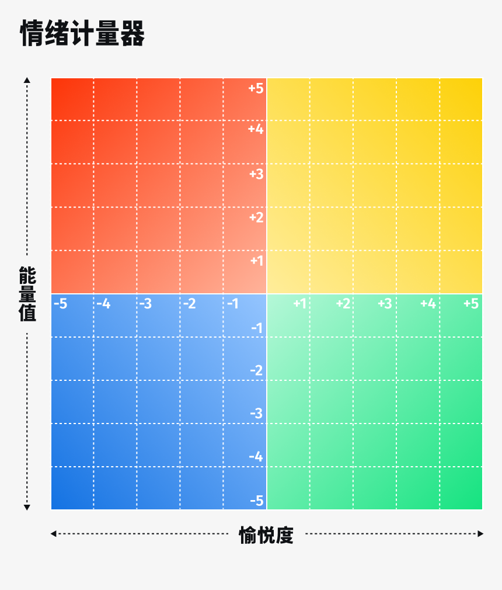
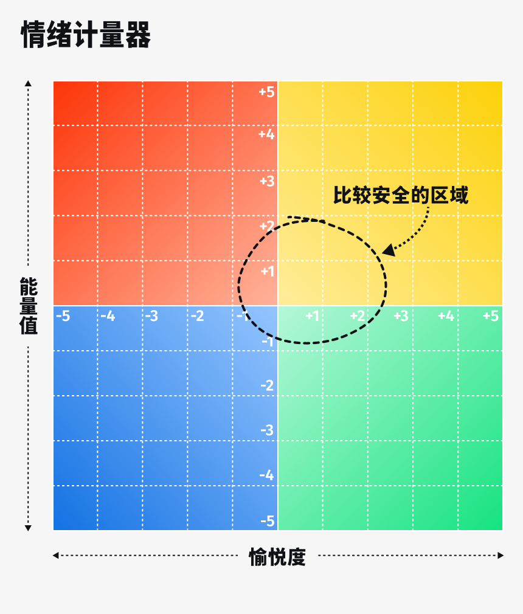

# 03 情绪雷达：聪明的决策为何要从识别情绪开始

大家好，我是玖洲，欢迎回到不止金钱，继续我们的投资之旅。

上一期，我们通过绘制「投资坐标图」来搭建个人投资框架，用「认知」和「情绪」两个维度标记行动范围。那如何确定认知和情绪的边界呢？

今天我们先从情绪说起，单纯讲投资的内容会稍微少一些，也需要调动一些想象力。

# 为什么做投资关注情绪如此重要

我想先引用一句话：我们知道了很多的道理，却依旧过不好这一生。这句话非常俗气，但在投资里尤其真实。现在各种讲投资的内容都喜欢从专业知识 ABC 讲起，但我从业多年的感受是：情绪和这些投资 ABC 同等重要，甚至更重要，但往往被一笔带过。说实话，在投资的世界里，情绪失控的案例一点都不少见。

讲一个有点尴尬的故事，我有一个同事是位经验丰富的投资人，因为做错了好几笔交易，有一次没有控制住，在办公室里面抽自己耳光。大家可以想象一下这个场面。我坐在那，突然听到对面传来啪啪的声音，出于尊重，赶紧把头扭过去，假装没看到。

我还有一位朋友不是投资人，有自己的工作，但开始炒股之后脾气变得非常差，差到影响了家庭关系。他的家人还给我打电话，要我劝他不要炒股了。我是一个从业人员，却要告诉别人「炒股有害健康」，等于是王婆卖瓜，还不能自卖自夸，非常尴尬。

那我自己呢？我其实经历过中度到重度的焦虑症，这没什么不好意思承认的，医生的诊断很好地帮助了我康复，否则我还完全不自知。从业十几年，我自认为适应了市场的剧烈波动。但有段时间，我和焦虑情绪对抗得太久，明明超过了边界，却还在作死的边缘疯狂试探。那是种什么感觉？就是晚上一闭眼，股票各种红色、绿色的数字就在眼前飘来飘去，基本无法入睡。

这里我想推荐一部美剧，大家有兴趣可以看一下，英文名叫《Billions》，字面意思就是几十亿。这部剧的前三季非常有意思，描绘了一个对冲基金大佬如何利用灰色地带和内幕信息做交易。在这家基金公司中，除了大老板和总经理，重要性排第三的人是一位心理咨询师，专门负责解决每个员工的心理问题，用专业技能让这些员工从负面情绪中走出来。这并不是开玩笑，有些欧美公司真的有这样的角色。但在国内机构里，我还没有见到过重要性这么高的专职岗位。

回到普通人的投资上，就一个建议：**做投资的时候，我们要时刻标注自己的情绪。**

良好情绪与负面情绪

回到我们之前画的「投资坐标图」。图上的水平轴上，一端是良好的情绪，另一端则是负面的情绪。

标出负面情绪，并不意味着我们不接纳这些负面情绪。

事实上，我们一定要接受我们是非理性的、情绪化的动物这一点。因为这一点无论如何也都无法改变。

即使是非常伟大的投资人也经受过情绪的折磨，比如 100 年前通过做空美股赚到 1 亿美金的利佛摩尔 (Jesse Lauriston Livermore)，号称「史上最伟大的交易员」，但他的人生终结于严重的抑郁症。

还有些人可能很自信，认为自己在工作中一向超级理性，又或者自己是非常严谨的工程师，所以在投资里也可以保持这种冷静。但是请相信我，**和「钱」玩游戏的时候，你并不是自己想象中的样子。**我见过很多冷静理性而客观的人，一旦投身在投资中，情绪就变得起伏不定。

在这里我想推荐一本书，叫做《思考，快与慢》，作者是丹尼尔·卡尼曼 (Daniel Kahneman)，他写的是心理学，但他其实是一位诺贝尔经济学奖获得者。这本书讲述了人在做决策时，是如何被直觉、情绪和情感操控的。**所有的决策都会被细节影响，而我们不一定自知。**

举个例子，快餐店里播放的音乐一般是快节奏的，装潢上也通常采用红色、黄色等比较明亮的颜色，这会让我们不由自主地情绪高涨，加快吃饭速度，餐厅也就能让我们早点吃完走人。书中还有更多例子，推荐大家去看。

而且「负面」并不是完全意义上的负面，它也有正面价值。比如我们认为紧张和压力是现代人经常出现的「负面情绪」，但事实上，这种负面情绪在很多场合可以帮到我们。

扯得远一点，我们的祖先还在丛林里吃树叶时，这种情绪就无数次帮助过他们。比方说当我们的祖先看到一只老虎，肯定超级紧张，这时他们的大脑里会出现一场「压力风暴」：压力把信号传递给肾上腺素，然后激素会调动全身各个器官，让心血管系统全速运转，更多的血液和能量被带到全身后，会让呼吸加速，更多氧气摄入，肌肉细胞也更加活跃，我们的祖先就会跑得更快，有更大概率逃命成功。

在现代社会，这种状态也一样会帮助到我们。比如第二天我有一个很重要的结案报告，时间非常紧迫。但一想起领导那张严肃的脸，压力就会让我的肾上腺素飙升，大脑更加专注，全身更有活力，熬夜加班效率也更高。

但是它也有反作用。在这种状态下，大脑不会要求我保持平静，所以我会变得脾气很坏，而且更有攻击性。当然这不是我的本意，它是写在基因中的自然反应。如果这个压力是短期的，那完全没有问题，搞定报告之后去大吃一顿，就能缓解紧张和焦虑。

**但不幸的是，在投资中，压力是长期存在的**。就像我陷入中度焦虑症时，每一天、每一刻，压力都不曾消失。在所有的投资落袋为安之前，都充满了不确定性。

什么情况下没有压力？就像我们前面提到的赚了钱的散户阿姨的故事，她把账户密码都忘了，发生了什么都不知道，自然也就没有压力。除非我们也把自己的账户密码忘掉，否则大概率会长期受到压力和负面情绪的干扰。

因此我们在坐标图上标记情绪的意义在于，要先觉察自己的情绪，自己到底是非常焦虑还是正在恐慌？又或者是很亢奋、贪婪？如果发觉自己正处在不良情绪中，就先不要做决策，或者放慢决策节奏。这也是一种自我关照，直白地讲，**宁愿先不做，也不要做出问题。**

# 如何觉察情绪

通常像压力、极度焦虑、异常悲观这些比较极端的负面情绪比较容易觉察，其中和焦虑有关的情绪甚至可以度量。现在有一种比较成熟的焦虑自评量表 (SAS)，是医生用于检测焦虑程度的重要手段之一，我之前也用过。这个评测量表在网上能找到，也能自测，大家可以自行搜索取用。

还有一种情绪与焦虑、悲观相反，也超过了良性情绪的边界，是危险的信号，那就是盈利之后的亢奋，以及随之而来的自我感觉超级良好等情绪。受这种情绪影响，我们会变得过于自负，行为更加冒进，很容易一头掉进风险里。

总的来说，上面这些情绪比较明显，它们分布在情绪的两个极值上，容易被觉察。但更多时候，不良情绪会更隐蔽。比如我虽然现在没有亏钱，但心里隐隐有些担忧，说焦虑吧，又没那么严重，可是我根本无法准确地描述这个情绪状态。

如何标注这种处在中间状态、可上可下、可大可小的情绪？这就需要跨领域的借鉴了。投资是一件综合性的事，只要有好的工具，就可以借过来用。

这里我要分享的就是教育行业的做法。

现在很多小学有社交和情绪教育，小朋友们不擅长表达自己的情绪，老师就让学生在不同颜色的贴纸里，挑选最适合表达自己情绪的一个，借此可以理解学生处在什么情绪状态，从而进一步了解发生了什么事。

这个用颜色标记情绪的工具有扎实的理论基础，是由耶鲁大学教授马克·布莱克特 (Marc Brackett) 和波士顿一位教授罗素 (James Russell) 共同开发的。他们在研究中发现，觉察情绪和表达情绪都是非常困难的。那我们是在东方文化圈里，教育、习惯和生活环境就更会让我们下意识掩盖自己的情绪，尤其是羞于表达负面情绪。

如何解决这个问题？他们也用到了一个坐标图。

这个坐标图里，人的情绪分为两个维度，分别是「能量」和「愉悦」。

横轴代表「愉悦」，从「极度不愉悦」到「极度愉悦」，简单来说也就是从很不开心到很开心。

纵轴代表「能量」，代表你精神够不够，有没有活力。同样也是从极低到极高。

这样一来，坐标图就被分成了四个象限。如果「能量值」和「愉悦度」都很高，就出现在坐标图的右上角，也就是第一象限。这时的你很乐观，很兴奋，感觉充满了精力。这个象限我们可以用明亮的黄色做标记，**像太阳晴空高照一样艳丽的黄色。**

如果「能量值」和「愉悦度」都很低，情绪就落在左下角的第三象限，它和第一象限正好相对应。这时的你可能悲伤、抑郁，心情低落，没什么精神。我们用蓝色标记一下这个区域，**像大海一样忧郁的深蓝色。**

说完了「双高」「双低」，我们来看剩下的两个象限。

一个是「能量值」很低，但「愉悦度」很高。这并不奇怪，其实在生活中经常出现，它表示你现在很平和满足，但精力未必充沛；也正因为精神并不亢奋，身体会比较放松自在。我们用绿色标记这个区域，**就像懒洋洋躺在一片绿色的大草坪上。**

反过来，如果你「能量值」特别高，但「愉悦度」比较低，就表明你可能感到愤怒、恐惧，身体也比较紧绷，需要发泄。这个状态我们标记为红色，**像涨红了脸的感觉。**

现在我们有了一个直观的坐标图。在我看来，这个坐标图最重要的地方就是原点附近。我们在原点附近画一个小圆圈作为比较安全的区域。

如果你的情绪在这个区域，哪怕你有一点点低迷或不开心，都是很正常的状态。毕竟我们也是要允许自己不开心、精神没那么好，人总不能永远兴高采烈呀，对不对。

我对照这个表做了自查。经历了过去两年投资市场的剧烈波动，我现在按理说应该很悲观。但自查后发现，自己只是偶尔有一些轻度焦虑，基本上通过读书、运动或看电影，就可以把情绪带回来。所以我对自己的判断是，大概还处在原点附近。

什么时候是比较危险的？假设我们现在处在黄色区域，也就是坐标的右上角。这个区域看起来能量值和愉悦度都非常高，但我反而觉得这是警示信号，你可能过度兴奋和乐观，进而导致行动鲁莽，忽视风险。这种情绪偏离原点太多，也被我定义为投资里的不良情绪。

说个题外话，这种在原点附近的情绪类似于佛经里经常讲到的极乐世界。什么是极乐世界？我小时候认为，极乐世界就是每天嘻嘻哈哈，极其快乐。实际上，**佛教认为「不苦不乐」就是极乐，这其实是比较适合投资的稳定情绪状态。**

专业的投资人面对情绪波动是一个挑战，不同的人有不同的方法。有的人是只要往佛祖面前一跪，情绪真能平复下来。我们投资圈内有个说法，大家听听就行，说是一些寺庙解决投资问题比别的地方更灵验，比方说北京东边的郊区有一个寺庙，投资人可以把投资组合写在小信封里烧给佛祖，佛祖收得到，也看得懂。

从寺庙说回来。有了这样一张图，我们做判断会更容易些。比如，如果你的情绪经常波动，一点点小的亏损都会让你特别难受，几乎感受不到任何愉悦。我会建议你先别做这个投资，先看一看，学习和了解一下也未尝不可，并不是每一个机会都要抢着赶上。**情绪不在原点附近，我们宁愿不做。**

我们也可以把这张图放到生活中的其他方面，用来标记我们的情绪。作为成年人，我们倾向于隐藏情绪，这其实是一种「憋屈」的状态，所以我们要把自己的情绪标记出来。用颜色也好，用警告的话语也好，或者就像我之前提到的清仓的同事一样，夸张一点写在墙上，都可以。

一位朋友和我讲过自己在日常生活中进行情绪觉察的案例。有一天她突然意识到自己和伴侣吵架的时间，大部分都发生在睡觉前。她觉得可能是和能量值有关，因为睡前又累又困，能量值非常低，并不适合进行沟通，沟通中的一点点小摩擦就会让情绪失控。

所以她后来和伴侣商量了一个方法，就是晚上睡觉前禁止讨论正事，只有在吃饱喝足之后，也就是情绪相对良好的时候，才沟通严肃的事。不仅如此，他们还定了一个暗号，用来告诉对方：「我的能量值很低了」。这样对方就会明白自己并不是故意闹别扭，也不是真的生气，只是此时此刻情绪不在原点的中心范围内，可以先放下争论。

所以，有意识地觉察情绪，对我们自己、我们的家人和周围的朋友而言，都很有帮助，可以避免很多不必要的误会。

讲完情绪，接下来我们会和大家聊到投资中的有效认知边界。

也期待大家分享自己的实际案例，看看大家在日常生活中，是否会用到什么方法去觉察自己的情绪？或者聊一聊，你身边有情绪很稳定的朋友吗？若有，你觉得他们都有什么特质？

那我们下一期接着，不止金钱！

# 延伸阅读 ：

- [美剧《亿万/Billions》，2016~2023 ](https://movie.douban.com/subject/26200198//)
- [《最火金融美剧<亿万>男主角的原型竟是他》](https://www.gelonghui.com/p/48386)
- [《思考，快与慢》，【美国】 丹尼尔·卡尼曼，中信出版社，2012 ](https://book.douban.com/subject/10785583/)
- [《陪孩子学会情绪管理》，耶鲁大学情绪智力中心，马克·布莱克特，科学技术文献出版社，2022 ](https://book.douban.com/subject/35916203/)
- [焦虑自评量表(SAS)](https://m.medsci.cn/scale/show.do?id=87b111489)