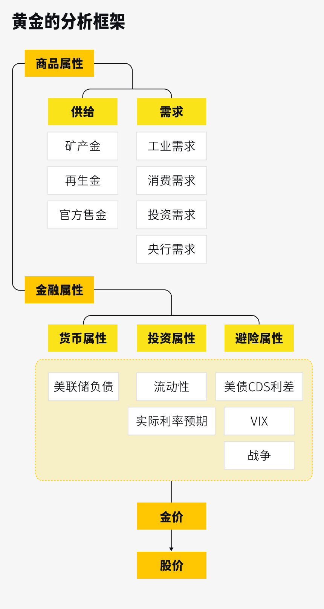

# 播客笔记

「有效认知」需要有证据逻辑。

要警惕「无效认知」，也就是那些似懂非懂的认知。

当我们面临海量信息，就要过滤信息的来源，选择高质量信源。

普通人不可能像机构一样砸钱，但是**可以用客观、可靠、多元这三个要素去过滤信息。**

在交流的时候，聊完了观点一定要问数字。

在没有一手信息的情况下，尽可能只参考严肃的信息源。

记不住没关系，**本质上是思维训练的过程。**

为什么是虚假的呢？**为了短平快，这种节目基本上会很直白地给出观点和结论。**但结论是如何得出的？依据是什么？事实又是什么？如何做出推理？推理是否正确？在这种较短的音频、视频和文章里，这些内容面都省略了。而且这些内容通常会用煽动性的语言，让你产生冲动，不思考太多，直接接受观点。**所以最终我们获得什么？一些似是而非的观点和结论，以及一堆情绪。**

# 05 认知放大器：建立自己的「有效认知」

大家好，我是玖洲。

上一期我们聊到阿克曼做空康宝莱一案和瑞幸咖啡造假案，有了这样一个结论：「有效认知」需要有证据逻辑。同时也我们也说到要警惕「无效认知」，也就是那些似懂非懂的认知。

我们再往前一步，提出一个新问题：如果我们就是一无所知，应该如何建立「有效认知」呢？

假设我们刚接触一个投资标的，参考上一期的调查方法，就是一个又费时又费钱的过程。我以前为了研究一家家电连锁企业，一个月里跑了二十几个县区的门店，从北京到江浙沪，耗时又耗力。最后几天，我觉得脚下有点异样，低头一看，发现皮鞋竟然走出了洞。

要找到「有效认知」并不容易，听起来有点头疼。先别急，我们上一期提到的案例算是惊天大案，所以投入的资源很多。投资机构在日常研究中，会用一些更简便的方法持续搜集信息，寻找证据。

那我们就解密一下，专业机构用哪些工具获取证据，用什么方法搭建逻辑，我们又能从中收获什么。

# 专业投资机构如何获取信息

投资机构中有专职的投研团队，少则三四个人，多则可以组两三支足球队。他们做的第一件事情就是到处找信息，尤其是各种客观证据。**当我们面临海量信息，就要过滤信息的来源，选择高质量信源。**

投资机构会从哪些地方获得信息呢？有个流传很广的说法，说某些投资大佬做投资，最关键的就是看《新闻联播》，把握实时政策动向。但这并不真实，现实生活中获取信息远远不止《新闻联播》。我总结了3 个常用的信息渠道。

**第一种，机构会花大价钱购买研究服务。**向谁买呢？向券商。投资机构会支付券商佣金，让券商的研究团队组织调研、提供报告等。可能你偶尔会看到某某券商的首席分析师在媒体上跟大家分享投资观点，没错，就是他们。他们主要为机构提供研究服务，有时也会利用公开媒体提升自己的影响力。

机构为研究机构支付的费用通常很贵，大家可以猜一下。我国第一艘航母「辽宁号」据说造价接近 200 亿元，而 2022 年全国券商加起来获得的佣金大概是 190 多亿元，这其中大部分是用来购买他们的研究服务和产品服务。也就是说，基金公司支付给券商的佣金，一年大概可以造一艘航母。

**第二种，专业机构会花钱建立专家网络。**这个渠道稍微有一点神秘，个人接触的比较少，费用也不便宜。就是请某个领域的专家核实信息，一般是按小时收费，一小时上千元。如果付费足够高，还可以和特定公司的管理层交流。

这个渠道其实是出现过重大事故的。2023 年中，一家叫做凯盛咨询的公司被国家安全机关调查，它做的就是这个生意。被查的原因是，它违规向境外机构客户提供了涉密信息，也就是引荐了专家，但专家泄露了涉及国家安全的数据，这样性质就严重了。专家网络水很深，稍不留神就会碰到合规边界。

当然，这种信息并不具备独占性，只要愿意付费，就可以通过中介公司找到专家。很有意思的是，我还遇到过假专家。因为大部分专家都是匿名，我通过声音和语言对比，发现竟然有一个专家假装是不同公司的员工。这个渠道坑是不是很多？

**第三种，自己干。**也是就留出经费，让自己的人出去调研。道理很简单：不能无条件相信别人。我以前工作时更喜欢和上市公司单独联系，一对一交流，绕开前面所有的第三方渠道，可以算是真正一手信息。不过比较累，我最多的出差记录是一年 120 多天，跑了六七十个城市。

最后我再介绍一个新鲜事物，叫「另类数据」。我们每天看新闻，提到的几乎都是传统的、公开的统计局数据。「另类」说明这种数据不常见，地上的、天上的都有。举一个地上的例子：电商销售数据。逛淘宝、京东买了些什么、买了多少，这些数据都可以被捕捉到。天上的数据有什么呢？已经跳出地球了，比如卫星地图数据，通过海运轮船的运动轨迹，以判断全球石油的运输交付情况；通过灯光遥感图，推测工厂开工的情况，因为开工一定会开灯；还可以通过识别建筑物的大小、体积，来推测房地产、基建工地的开工情况等。听起来是不是真的很另类？如果有人不相信公开的数据，就可以从另类数据的角度验证一次。

上面是我总结的机构最重要的信息获取方式。我可以再提炼一下，说一下其中的值得关注的点。

**第一，机构非常在乎信息多元化。**他们需要不同种类的数据。我之前引用过一句话：我们看到的都只是一个角度，而不是真相。所以需要更多的角度，交叉验证手上的信息。

**第二，机构非常在乎可靠性。**信息的来源要尽最大可能确保足够可靠，这也是付费的原因之一。天下没有免费的午餐，免费的信息往往不容易判断是否可靠。同样，研究团队自己调研也是因为，第三方渠道可能存在不可靠因素。

为了实现多元性和可靠性，机构花了不少成本。我们前面提到，单是佣金就高达 190 多亿元，还有调研、差旅、访谈专家等费用。一年到头，所有机构在信息获取和研究上大概会花费两三百亿元。

# 普通人可以如何借鉴

普通人不可能像机构一样砸钱，但是**可以用客观、可靠、多元这三个要素去过滤信息。**

现在大家都喜欢刷短视频、朋友圈、公众号，我也有这个习惯，严谨的财经信息越来越少，一天到晚都是大新闻、大事件、大趋势。其中有很多是经过二手加工的垃圾信息，并不可靠，数据也有问题，经常是得到一个片面的数据就开始滥用。

那如果没有机构资源的支持，普通人可以怎么办呢？

我自己筛选信息的方法，可以给大家做一个参考——**尽量找一手信息**。

比如想了解某个行业，就只找在这个行业中有经验的朋友交流，没有相关从业经验的一概不听，这是可靠性。那多元性呢？多找几个朋友就可以做交叉验证。**在交流的时候，聊完了观点一定要问数字。**如果找不到相应的朋友也没问题，我觉得声动活泼可以再开一个节目，就叫「交个朋友」，把我们背后的行业嘉宾资源都利用起来。

**在没有一手信息的情况下，尽可能只参考严肃的信息源。**

如果要看偏宏观的内容、看新闻，我比较喜欢《财经》，比花边小道的财经分析更严肃；如果要看行业，在行业协会的网站一般可以找到某个行业的年度报告、统计数据。不少行业都有协会，比如互联网协会、黄金协会等，这些协会是我们获取信息的有效途径。虽然都是二手信息，但审核会严格一点，也算是帮我们筛选了一遍。我不会从公众号里找行业信息。

# 不可或缺的分析框架

在了解了一些可靠、多元的信息——也就是获得了「证据」之后，如何获得「逻辑」呢？

在投资机构中，研究团队通常会分成不同行业组，每个行业组专注于各自的领域，他们会沉淀一套非常细致的「行业研究框架」，还会定期开展内部培训。

什么叫研究框架？**所谓的研究框架就是剥洋葱，告诉我们怎么一层一层向下剥，最终把洋葱的核心剥出来。**又到了干货部分，我还是举例说明。

下面是一个黄金的分析框架，来源是光大证券研究所，可以给大家做参考。我稍微解释一下。比如黄金框架最终的目的是理解黄金的价格如何变化，于是我们就要一层一层地把影响黄金价格的因素剥离出来：黄金作为一个商品，它的供给也就是产量有多少，受哪些因素影响；它的需求又怎么细分，受哪些因素影响。把这些因素按照逻辑顺序归纳起来，最后就得到一张像树杈分支一样的框架图，所有分叉都是为了理解黄金价格受哪些因素影响。我们说的证据就对应这个框架中的每一个元素。

第一次看到这张图可能会觉得看不懂。其实也不用追求立刻就看懂，先感受一下研究框架长什么样就可以。研究框架可以很复杂，也可以很简单。黄金这个算是个复杂案例，但不意味着个人无法学习这些研究框架。

首先，贪多嚼不烂，我们可以在一段时间里只选择一个东西研究。比如在起步阶段搞清楚什么是股票基金、货币基金，什么是股票。

如果想投资一个具体的行业，也有一些比较方便的获取途径，这些研究不再是专业机构的特供产品。一个比较简单易得的方法是，注册一个第三方研究报告系统，这些研究报告名义上不针对个人投资者，只提供给机构，但我们可以以公司做研究的名义去开通相关账号。

如果我们想看消费行业，就搜消费行业分析框架。同样，比如白酒、啤酒、房地产、汽车等行业都有类似的分析框架。这样就可以看到专业的分析师在用什么框架和逻辑做研究。你也许会觉得太难了，根本记不住。我也记不住，要用的时候才会找相应的框架。我们没必要像职业分析师那样，记住所有元素。

而且了解投资，应该是比较轻松愉快的事，而不是增加心理负担。记不住没关系，**本质上是思维训练的过程。**过程中会接触到不同领域的信息，了解其他专业人士看待这个领域的思维框架。可以把这些思维训练想成一个习惯，从而让我们习惯性地用框架思维思考问题，并在上面搭建自己的逻辑。久而久之，「有效认知」就会扩大，「舒适能力圈」也会变得更大。

总结一下，如果要拓展「有效认知」，从身边的朋友圈也好，第三方的公开渠道也好，都能找到可靠的高质量信息源，并整理自己的认知框架。虽然我们有一个简化的方法，但还是一个需要长期积累的过程，就像我们之前说到的，其实这个过程也是在投资自己的时间，我们花这个时间和精力，就是帮助自己在投资世界里面不被轻易忽悠。我倒不觉得学了武功就一定要出去打架，但用来防身还是有必要的。

# 生活中的「有效认知」

聊了这么多干货，那在日常生活中，有没有哪些跟「有效认知」相背离的事情？

我观察到一个很有意思的现象，越来越多的节目宣称「10 分钟带你学会价值投资」「 10 分钟带你听完一本书」。现在确实是一个快时代，大家的注意力越来越稀缺，很多人想把一本书、一个理论也变成快餐，期望消费完，自己就能变得学识渊博。一开始我也很好奇，但尝试一些后，我认为这并不是一个有效的方法，它带来的是一种虚假的获得感。

为什么是虚假的呢？为了短平快，这种节目基本上会很直白地给出观点和结论。但结论是如何得出的？依据是什么？事实又是什么？如何做出推理？推理是否正确？在这种较短的音频、视频和文章里，这些内容面都省略了。而且这些内容通常会用煽动性的语言，让你产生冲动，不思考太多，直接接受观点。

所以最终我们获得什么？一些似是而非的观点和结论，以及一堆情绪。

大家可以回想一下，吃完这些内容快餐之后再回味一遍，你收获更多的是情绪还是事实？比如，巴菲特的演讲都是公开的，但一些自媒体会在几个小时的内容里提炼出几句关键的话，这些话看起来都特别对，但却无从操作。巴菲特在做决策的时候选择了哪些证据，采用了哪些逻辑，经历了什么困难，我们都不知道。

而且这种短视频也好，文章也好，可能截取的就是几句特别抓眼球的话，脱离语境就变味了。这种内容不一定能带来「有效认知」，甚至可能带来负面认知。比如，我们说要长期持有，这句话就是非常经典的巴菲特名言，听起来很正确，但是如何落地？它的上下文是什么？在巴菲特的投资组合中也有半年就卖掉的，又该如何解释？为了做到长期持有，巴菲特具备哪些我们不具备的条件？

两三年前，国内有一本流行书，说要做时间的朋友。这句话就被拿出来滥用，做成各种各样快餐式的分析，但前因后果都没有讲清楚。我觉得问题不在于我想不想做时间的朋友，而是时间不想和我做朋友。

相比而言，我更喜欢看书和长文章。因为在这些内容中会给出案例，证据也更加充分，可以让我们详细理解作者的立场、引用的事实和思考的逻辑链条。优秀作者的宝藏并不是他们给出的结论，而是他们的经历和案例。我会假想自己坐在作者对面向他们提问，持续问为什么，用什么逻辑来论证，这个过程非常有趣。我之前提到丹尼尔·卡尼曼的《思考，快与慢》，这本书的结论非常简单，一张 A4 纸都用不了。那为什么要写本书呢？当然不是为了更好卖钱，而是他在书里会展示自己的推理逻辑，还有各种案例支撑，这就比二手信息解说这个结论更有价值。

为什么我没有直接讲投资建议，而是解密专业机构的方法论和工具箱？看起来好像花费了额外时间，实际上是提供真实的案例，这些案例就是为了给大家提供证据，从而理解证据是如何嵌套到观点中的。

那在这一期节目的末尾，也欢迎大家来聊一下，你平时喜欢用什么方式或工具来获取新知识 ？ 你觉得它为什么好用？

我们下期节目再一起，不止金钱。

# 延伸阅读 ：

- [券业年产近20万份研报、覆盖逾3000家公司，背后有怎样的分仓佣金江湖？](https://m.yicai.com/news/101683982.html)
- [网罗百万专家，揭秘凯盛融英背后的“商业秘密猎手”](https://new.qq.com/rain/a/20230616A0006100)
- [“上天入地”找数据： 大资管用卫星研究宏观经济，效果如何？](https://m.21jingji.com/article/20200318/6ce123a4fc238486829e95b653cf160d.html)