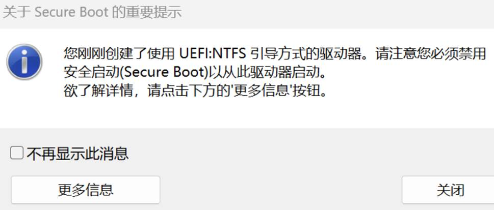

# 系统重装步骤

1.	8G以上内存的U盘作为启动盘
2.	微软官网/其他途径下载所需系统的iso镜像文件
   a)	[微软官网下载iso镜像（只有最新版本）](https://www.microsoft.com/zh-cn/software-download/windows10)
   注：微软官网可以选择“创建Win10安装媒体”得到的iso点开后可以直接装进U盘，而无需借助3这一步的工具
   b)	[其他途径下载iso镜像（历史版本）](https://hellowindows.cn/)
   注：只有BT种子链接，复制后在百度网盘-云添加-添加链接任务-粘贴后得到
3.	通过Rufus将镜像文件导入启动盘
4.	启动盘插入电脑进入BIOS开始重装系统（禁用安全启动）

# 有用的链接地址

- [微软官网下载iso镜像（只有最新版本）](https://www.microsoft.com/zh-cn/software-download/windows10)
- [SEU下载iso镜像（最新版本）](https://software.seu.edu.cn/soft/detail/1)
- [其他途径下载iso镜像（历史版本）](https://hellowindows.cn/)
- [Rufus用于将iso装入启动盘](https://software.seu.edu.cn/soft/detail/14)
- 系统激活方式（需要连接SEU VPN）
  - [KMS方式激活](https://software.seu.edu.cn/help/detail/819)
  - [客户端方式激活](https://software.seu.edu.cn/help/detail/2)

# FAQ

## 禁用安全启动

**通过Rufus将iso镜像文件导入U盘启动盘时提示需要“禁用安全启动”：**

 

**[“为什么以及如何禁用安全启动”的详细信息（点我跳转）](https://github.com/pbatard/rufus/wiki/FAQ#Why_do_I_need_to_disable_Secure_Boot_to_use_UEFINTFS)**

**如何禁用安全启动？**

除非您使用的是微软几年前试图推出的 32 位 ARM 系统之一（并且引起了如此大的强烈反对以至于制造商从此放弃了生产此类系统的想法），否则**始终**可以禁用 *安全启动以进行 UEFI* *启动。*

大多数情况下，这很简单，只需进入“BIOS”设置并切换“安全启动”选项即可，但是，有些制造商可能会使这个过程比其他制造商更困难一些。因此，为了帮助您确定如何在操作不完全简单的硬件上有效禁用*安全启动*，您还可以参考下面的非详尽列表：

**宏碁硬件**

在某些 Acer 平台上，存在*安全启动*切换开关，但除非您为“BIOS”设置了管理密码，否则该开关可能会变灰。解决方案是添加密码以进入 BIOS。然后您应该能够禁用*安全启动*。

**其他硬件**

您可以通过查看[Rod Smith 网站上的此链接](http://www.rodsbooks.com/efi-bootloaders/secureboot.html#disable)找到一些有关如何禁用其他平台的*安全启动*的提示（该网站还包含有关 *安全启动*和 UEFI的优秀信息）。
