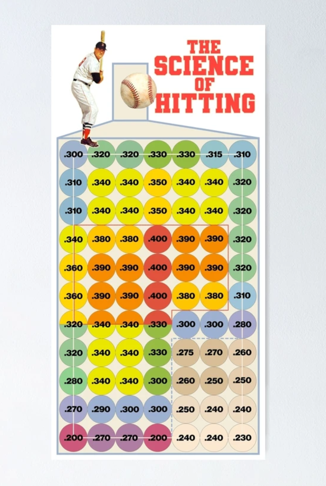

# 播客笔记

1. 即使在「舒适能力圈」中，有时也要「有所不为」
2. 投资时不是所有的机会都必须抓住，控制动手的次数反而会有正面的效果。
3. 职业击球手击中的概率大概是多少呢？大家可能会认为他们十个球里能击中七八个。事实上，击中率在 28% 以上，就能被称为职业击球手；30% 就是优秀击球手；如果达到 40%，就会被称为伟大的击球手。**当你知道「不打」什么球的时候，才是真正「打球」的开始。**投资的秘诀就是坐在那里，观察一个又一个投球，等待最适合你的球。
4. 《西游记》有一集讲的是**误入女儿国**的故事，唐僧进去后就开始左躲右闪，满眼都是风险，不停拒绝漂亮女生的邀请，有所不为。猪八戒也跟着唐僧一起进去，他心花怒放，满眼看去都是机会。**唐僧就是有意识管住手的专业投资人，能力圈之内也无动于衷，而我们有可能就是没有意识到风险的猪八戒。**
5. 

# 09 放弃的能量：有所不为也能大有作为

大家好，我是玖洲。

今天我们要聊一件反直觉的事，**即使在「舒适能力圈」中，有时也要「有所不为」。**可能你还没反应过来，我们花了那么多精力探索「舒适能力圈」，结果肉都到嘴边了，怎么却说不要吃呢？

先提出一个问题，投资中最难的事是什么？可能听到很多不同的答案，比如赚钱难、认知难，或者保持冷静难。

但我的回答是，看到机会却什么都不做，最难。事实上，**投资时不是所有的机会都必须抓住，控制动手的次数反而会有正面的效果。**这样说是不是太保守了？在这里给大家分享一个棒球手的故事。

# 不去击打某些球

泰德·威廉姆斯（Ted Williams）是波士顿红袜队的传奇击球手，创造了很多项纪录，被称为「史上最伟大的击球手」。先声明一下，我并不是棒球专业人士，只是学过几节棒球课，会打而已，这个故事是投资圈里有名的故事。

威廉姆斯能力非常强，从小就有天赋。但有意思的是，他虽然能力强，但比赛时对飞入他能力圈范围的球，并不都会击打，而是只会挥杆击打某些球。

在他写的《击球的科学》这本书里，他解释说，自己会精确地把击打区域分为 77 个小区域，每个区域大概一个棒球大小。他只会击打那些落在他称之为「理想击球区」的球。能力圈是他可以行动的范围，但击打区是成功概率最高的区域。
[.png)](https://sdhp.memberful.com/rails/active_storage/blobs/proxy/eyJfcmFpbHMiOnsiZGF0YSI6MTIwNjk5LCJwdXIiOiJibG9iX2lkIn19--35323a0d1ae1a866132cc63d291b3200243cffad097819c1cc213704e0f264d2/不止金 (1).png)

猜一下，职业击球手击中的概率大概是多少呢？大家可能会认为他们十个球里能击中七八个。

事实上，击中率在 28% 以上，就能被称为职业击球手；30% 就是优秀击球手；如果达到 40%，就会被称为伟大的击球手。威廉姆斯自己都说，「棒球是唯一一个 10 次里面成功 3 次就算成功的运动」。他知道球飞到哪些位置时，击打起来最顺手，最有力，也最自信（自信是一种情绪），这时他才能打出最有质量的球，因此这也就是挥杆的最佳区域。

他采用了一套科学的底层思维框架，才有了标着 77 个小格子的击球区。他会精确记录自己在不同区域中的击中率，把击中率目标定在 40%。进入能力圈范围的球，一旦偏离了 40% 这个目标，他宁可不挥杆。

我对照这张图数了一下，77 个小格子中，有 3 个格子的击中率在 40%，12个格子的击中率在 38%—39% ，加起来也只有 15 个小格子，其他的格子击中率会迅速下降，最低只有 20%。因此，能够算得上理想击球区的，仅有 15 个。

借用威廉姆斯的一句话，**当你知道「不打」什么球的时候，才是真正「打球」的开始。**

这样的策略使他能很好地控制自己击球的效果，也让他成为棒球史上最出色的击球员之一。并在 1941 年以 40.6% 的击打率结束了赛季，创下了棒球界的纪录。

# 巴菲特的成功率

这种即使在「舒适能力圈」范围内，依然「有所不为」的策略，后来被巴菲特借鉴了过去。

据说在巴菲特办公室的墙上，就挂着一幅威廉姆斯的照片。为什么巴菲特会这么看重这个策略，还要挂一张照片？因为投资行业的「击中率」也相当低。

猜一下，如果股票投资，赚钱就算成功一次，亏钱就算失败一次，成功概率能达到多少？

答案是大约 50%，当然还有比 50% 概率更低的投资。在一级市场上，一般情况下，如果投资创投企业的风险投资基金，10 个项目里有一到两个能成功就很不错了，可以说是「九死一生」。这不是开玩笑，成功概率可以低到 10% 或 20%。回头来看 2015 年开始的创业风潮，真正能够存活并做大的企业并不多。俗话说「人生不如意十有八九」，时间越长我越能感受到这句话的真实性。

但你可能会疑惑：如果抓住机会，成功的概率就是 51%，再多一点就算优秀了，还有 49% 的概率在亏损，岂不是盈亏抵消，什么都没有赚到吗？

这就是巴菲特借鉴威廉姆斯策略的原因，他希望投资变得更稳健，所以更耐心等待那些能带来高回报的机遇，就像等一个能进入自己「理想击球区」的球。他曾经说：「**投资的秘诀就是坐在那里，观察一个又一个投球，等待最适合你的球。**如果人们在旁边大喊，『快挥杆，你这个混蛋！』，请忽略他们。」

如果我们去看巴菲特的公司——伯克希尔哈撒韦公开的投资组合，会有一个让你大吃一惊的现象，巴菲特目前管理的资金大概是 3500 多亿美元，相当于 2.5 万亿人民币，其中 90% 的资金都投在 10 只股票上，有一些股票持有长达十几年，当然也有一些小的仓位，可能不到一年就会改变一下，但大多数持有期都是 3 年、5 年或者更长，所以他挥杆击球的次数其实是不多的。

巴菲特自己也解释过，他说如果我们有什么优势的话，那就是能够认识到自己何时非常好地待在了能力圈之内，又是什么时候正在接近能力圈边界。

硅谷中一些一级市场投资人也在践行这样的理念。过去十多年有很多创业公司冒出来，有些风险投资机构的方式是不断撒钱，每个创业公司都沾点股份，比如名气很大的投资公司 A16Z，平均一年投资 130 多次。但也有一些老牌投资公司非常保守，比如 Greylock 的投资人可能一年就出手 1—3 次。

还有一位中国投资人叫段永平，他是小霸王和步步高的创始人，和今天的 OPPO、 vivo 也关联密切。他的投资很简单，常年重仓苹果和腾讯。他曾说：巴菲特这么高的水平都只能投资十几只股票，像我这种水平能投两三个就非常不容易了，因为要了解一家公司非常难。

其实，能做到这一点的人还是很少的。

国内专业投资机构投资人的「换手率」其实非常高。「换手律」是一个专业术语，表示在一定时间内股票转手买卖的频率，反映的是一个投资人「出手击球」的次数。用国内投资机构和美国共同基金的换手率做对比，美国共同基金的换手率差不多在 0.5、0.6，也就是近两年换手一次。再看国内机构，2021 年偏股型基金的换手率算是比较低的，也有 2.4，相当于一只股票一年转手买卖 2.4 次。之前还有更高的数字比如 5.6，差不多是两三个月换手一次。所以，「击球次数」在不同地方有很大差异。

结果就是，今年诞生一个明星基金经理，明年又换面孔了，常青树非常少见。

# 减少挥杆次数

要做到即使是在自己的能力区范围内，也能有所为，有所不为，其实是对投资人提出了更高要求，比如对投资标的了解的深度，对自己判断的把握程度。

普通投资人和专业投资人的差别可能在两个方面：一是意识层面，二是识别机会的专业能力层面。

意识层面是什么意思？就是我们可能压根没有意识到这件事。《西游记》有一集讲的是误入女儿国的故事，唐僧进去后就开始左躲右闪，满眼都是风险，不停拒绝漂亮女生的邀请，有所不为。猪八戒也跟着唐僧一起进去，他心花怒放，满眼看去都是机会。唐僧就是有意识管住手的专业投资人，能力圈之内也无动于衷，而我们有可能就是没有意识到风险的猪八戒。

而在专业能力层面，我们和专业投资机构肯定会有差距。但我也一直在说，做投资不仅依靠专业知识，还有很多其他变量。反过来想一下，我们也可以通过减少挥杆次数，减少失误带来的损失。

其实，专业机构也会努力减少挥杆次数。

有一个词叫「确信度」，我们每一次推荐投资机会，都会被老板问一个问题：你的确信度是多少？这是个主观判断，但我相信每个人对每个机会都会在内心有所判断。经过研究，你一定知道什么东西是让你雷打不动、一定要坚持的，什么东西是让你犹豫的，哪怕是隐约在心底的犹豫，这就说明你的确信度在下降。做投资决策的人往往会面对上百个机会，他也会从确信度的排序上，优先选择确信度最高的几个标的。

其次，我们在第一期中就聊到过，在投资机构中做研究非常耗费时间。刚入行时，我会觉得有些研究耗时太长，结论也大差不差，好像没有必要花费那么多时间。但我后来意识到，这样的长流程本身也限制了投资的速度，减少了基金经理「挥杆」次数。举个例子，原先完成一次调研就可以做决定，现在提高到 10 次调研才能做决定。那么同样的时间，本来可以找到 10 个机会，现在只能找到一个。这也是一种通过设定研究流程减少挥杆次数的方法。

对于普通投资人而言，本来在有效认知的广度和深度上，就会存在劣势，不会什么都懂。这种情况下，还不如把做决策的数量降下来。

我有一个很实际的建议，如果总是忍不住频繁操作，频繁动手找机会，那就设置一个行动前的障碍。这个障碍可以是研究一段时间再动手，比如一周或一个月；也可以是规定数量，比如有 3 个机会只能选一个，有 10 个机会只能选 3 个。**不用担心错失机会，只要活得时间足够久，机会随时会浮现出来。**

# 人生中的重大决定

在投资中，挥杆是个简单的道理，那在生活中应该如何挥杆呢？我们可以有很多目标，可以做很多事情，但哪些事情落在我们的「理想击球区」，哪些并不是呢？还有，我们有没有胆量对一些机会说不呢？

在日常生活中，其实只有少数时候才会刻意思考这个问题，多数时候都是疲于应付飞过来的球。有时候被诱惑，觉得万一这次运气好，能够一击得中呢？

想象一下，生活中也有一个「击球区域图」。我们可以思考哪些事情是长期要做的，而且不仅落在「舒适能力圈」，还会落在「理想击球区」。对于这之外的机会，可能管住手就可以减少不必要的风险。

比如，我很喜欢投资，这是我的「舒适能力圈」，我也会花大量时间学习业务能力，思考这个领域做事的方法。这个节目就是我思考的结果，我也很喜欢花时间来做分享。但我也会遇到一些其他机会。我记得 2015 年新三板刚推出不久，特别火爆，很多人在里面赚了快钱，有位师兄来找我，说实现财富自由的机会到了，一起出来做新三板基金如何。我思考了很久，我对新三板没有确信度，发财的机会也就只能让给有确信度的人。事后证明，新三板不是一个好地方，但那并不是我能预判出来的，仅仅是我当时并不想「挥杆」。

有段时间，一二级联动投资也非常火。或许是因为过去高瓴资本展现了非常成功的投资案例，很多一级机构也在学习这种模式。我也陆陆续续接触到好几个机会，很有诱惑力，似乎有所作为的空间又被打开了。但当我研究了很多细节问题后，发现自己的确信度依旧不高，可以做，但不是我期待自己要「挥杆」的地方。所谓的联动有很多非投资领域的问题，我并不想花精力去解决这些问题，所以，我还是选择在原来的领域继续深耕。

有个词叫「情深缘浅」，「情深」就是我对这个机会很着迷，「缘浅」就是这个机会并不在「挥杆区」。既然如此，我宁愿作罢。

假如你是一名工程师、程序员，或一位文艺创作者，那你的「理想击球区」一定和我不一样。所以，你也一定有自己要放弃的其他机会，才能使得自己在某个机会上有所作为。

在这期节目的结尾，我也想问问大家，有没有放弃过自己很心仪的机会？是什么促使你做出这样的决定？不妨在评论区，一起交流一下，期待大家的分享。

那我们就下期节目再接着，不止金钱。

# 延伸阅读 ：

- 《The Science of Hitting/击球的科学》，Ted Williams，1986
- [伯克希尔哈撒韦公司投资组合持仓](https://fintel.io/zh-hans/i/berkshire-hathaway)