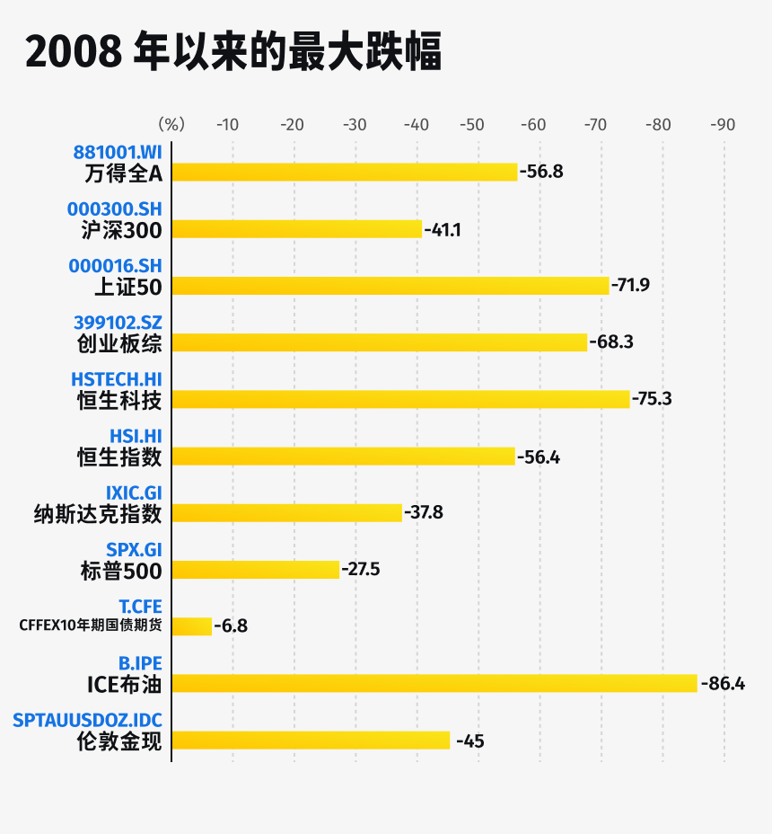

# 播客笔记

1. 无论如何，一定要在自己的心理账本中设置一条止损线
1. 不要依靠别人，没有人会比你更关心自己的钱包。
1. 最优的方式肯定是和机器人一样，二话不说立马止损。但我们是人，要超越人性很困难。**既然做不到最优解，就寻找次优解**，这本身也是一种生活态度。
1. 说起来好像特别简单，实际做起来，**需要持续不断给自己心理暗示，才能养成习惯。**
5. 把止损线用到生活中。分享一个概念叫做「情绪止损」，因为情绪也是资源，用光了就没了。

# 10 止损的艺术：有效自救指南

大家好，我是玖洲。

上一期我们聊到，即使是在自己的「舒适能力圈」里，也不是所有机会都要出手。我们要减少决策的次数，管住手，因为不确定性永远都在，最牛的击球手和投资人成功概率也不高。

如果一击不中，出现了亏损怎么办？如果连本金的 99% 都亏掉了，又要怎么办？

今天开始，我们就进入一个更有挑战性的，实操时一定会经常碰到的环节——止损。

我就有这样的血泪史。我在读书时有一个小小的美股账户，投资过一支股票，后来竟然下跌了 99.9%。是什么股票我就不说了，但是请大家脑补一下，跌 99.9% 是什么概念。有一部老港片叫《大时代》，主角丁谢在港股市场做投机，亏到了大概这个数字时就跳楼了。幸好我没有赌上全部家当，很是后怕。

当然，我在这里也可以剖析一下自己，究竟为什么亏掉这么多。不知道大家有没有过这种感觉，做投资的时候，钱就变成了虚拟数字。我们在心理上会有一本虚拟账本。这些钱亏也好、赚也好，都不会像拿在手里的钱那样真实。所以，当时股票虽然在下跌，但我觉得只要没有卖，心理账本上的亏损就没有变成真的，还有涨回去的可能；而一旦卖掉，就算涨回去也与我无关了。所以即使股票一直在下跌，我还是觉得不能卖，哪怕留给子孙，说不定哪天也能回本。

这就是虚拟记账，也是多数老投资人曾有过的心理写照。但它实际上是一种逃避，尤其是血淋淋的金钱损失，谁都不想面对。但事与愿违，这种不想面对、试图用时间来换空间的做法，导致我一等再等，损失越来越大，最终等来了 99% 的亏损。然后就是一记耳光，黄粱一梦，梦醒了。

# 面对亏损，机构如何自救

有没有比较好的应对方法呢？我们看一下专业机构的实践。

专业机构在投资实践中亏 99% 的情况应该非常少见。偶尔会有爆仓，比如我们一开头讲到的比尔·黄的故事，是操作上有重大合规问题。我并不认为他们的风控团队真正发挥了作用。

通常情况下，机构会被动止损，强制卖出股票；如果是其他类型的投资，就强制清算变现。

那是什么约束力量，让他们能止损卖出、而不是等待股价回升呢？

一是系统加持。相当于铠甲附身，强迫止损。我们在第一期里提过，机构中的风控团队会六亲不认，追着你做止损。当然，这有一点绝对，很多投资公司毕竟是民营企业，风控团队也认老板，可能对老板约束力不强。毕竟咱们都是打工人，都懂的，谁也不想得罪老板。

二是通过合同、合约明确止损线。每个基金在成立时，都会签署一份基金合同，详细规定预警线和止损线。一旦写进合同里，老板不执行就会被投资人告到法院。所以，这个强制手段是有法可依的。

再说一个具体一点的情况，比如一个基金在前两年都赚了钱，第三年跌了 30%，整体来看，这 3 年并没有亏损，那它还需要止损吗？

答案是需要。这种需要不是基金合同的要求，而是公司内部的要求。止损线有很多种类，包括年度止损、月度止损、整体止损等。比如，有的公司会规定年度止损线是 30%，从每年 1 月 1 日重新开始计算；或者是每个月亏损不能超过 15%，从每个月的月初重新开始计算。总之，可以层层嵌套。风控团队会把每个月、每年犯的错都滚动计算一遍，这就有点像「天网恢恢，疏而不漏」，跑不掉的。

所以，专业机构也是依靠外力制衡，毕竟止损是一件逆人性的事。天生就会做、没有一点心理障碍的概率大概低于 1% 。

# 普通人亏损了还能怎么做

那我们普通投资人可以怎么做呢？

1. 我通过惨痛教训得来的第一条经验就是：**无论如何，一定要在自己的心理账本中设置一条止损线**。

   机构的做法值得借鉴，但不能照抄。机构通常达到 30% 的损失后才会强制止损。但对于个人来讲，我观察到的现象是，亏损达到 30% 后，你就会灰心丧气，直接躺平了，这也符合正常人的情绪。因此，控制风险就是要尽量缩小心理账本。

   我的建议是，**把止损控制在更小的范围内，**比如 10% 或 15%。我在量化投资策略里见过更严格的：只要下跌到了成本线，即使还没有产生亏损，也照样把投资标的清仓。当然，这只是个参考，我们肯定不会这么严格。不过尽量缩小心理账本之后，负面情绪和心理负担会降低很多。

   

2. 随之而来的第二个问题是：我们又没有风控团队，常常因为忽视或忘记，而注意不到自己该止损了，这要怎么办？

   我一般会用一个非常简单的提醒功能，几乎所有投资 App 都会有这个功能，只需要把具体的条件填进去，一旦达到你所设定的条件，就会自动弹窗提醒。**不要依靠别人，没有人会比你更关心自己的钱包。
   **

3. 马上第三个问题又来了：即使有提醒，还是下不了手。这要怎么办？

   这也很常见。道理都懂，但事到临头，总觉得万一错了呢？万一止损之后，价格立马反弹了呢？这其实是一种非常典型的「后视镜效应」，在我们生活中经常出现。简单来说，就是我明明已经错了，但还是先拖着，担心止损后事情又变好。心理学上也有一个专门的术语形容这种状态，叫做「损失厌恶」，就是指损失带来的痛苦，会大于收益带来的快乐。

   我自己总结了一个方法，让这个过程变得不那么痛苦，就是**分阶段止损**。举个例子，假设我的亏损接受度是 10%，接近 10% 的时候我会变得犹豫不决，下不了手，强烈期待反转发生。那我可以至少先止损一半，这样心理上的接受度会高一点，毕竟还留着另一半，可以观察后续变化。如果最坏的情况发生，损失也会缩小一半。

   剩下的一半怎么办呢？再设置下一个止损线，可以是下一个 10%。如果情况再恶化，就再重复一遍上面的动作。当然，这并不是最优方法，最优的方式肯定是和机器人一样，二话不说立马止损。但我们是人，要超越人性很困难。**既然做不到最优解，就寻找次优解**，这本身也是一种生活态度。

   如果把自己逼得太厉害了，情绪可能也会受到影响，变得很糟糕。所以，从折衷的方法开始，先行动起来，走出第一步，总好过原地踏步。

   说实话，我有时候也会很自责，但我们一定会做错，这一点不用怀疑。止损的出发点就是控制风险，而不是赚钱。只要这个目的达到，我们就该很坦然了。

# 积极自救，不要侥幸

如果讨论到这里，你还觉得亏损的风险并不十分惨烈，那来看几个血淋淋的事实。

我们来盘点一下，几种比较典型的投资标的从 2008 年以来的最大跌幅。「最大跌幅」的含义是：从 2008 年至今，如果你在价格最高点买入，跌到最低点时所承受的损失。当然，我们不一定会买到最高的价格，所以这是一个「假设」的损失幅度，但可以提供一个参考。

首先，所有股票市场都出现过特别恐怖的大幅下跌，中国市场下跌的惨烈程度高于美国市场。比如我们的创业板指数，最大跌幅接近 70%，而美国纳斯达克指数的最大跌幅接近 40%。黄金看起来的确是更安全的资产，最大跌幅超过40%。

那石油呢？尽管大家似乎都觉得油价易涨难跌，但在我们的考察区间里，它的最大跌幅竟然超过 80%，所以也要谨慎。2020 年中国银行推出过一款产品叫「原油宝」，面向普通投资人出售。新冠疫情暴发后，原油暴跌，甚至一度跌到了负油价（这背后的原理我们可以之后讨论）。这次暴跌让很多投资人承受了巨大的亏损。

此外，大家是不是觉得余额宝这类产品不会亏？理论上，这类产品属于货币基金，收益率差不多是 2%，属于非常安全的资产。但是在 2008 年金融危机时，美国的一支货币基金由于重仓购买了雷曼兄弟的商业票据，也阶段性地亏了 3%。

另外不得不提的是房地产。我老家在三四线城市，当地的朋友特别喜欢买房，能多买一套是一套。当然，在投资领域，地产是非常重要的组成部分，一些知名大学的捐赠基金也会把相当比例的资金投到房地产上。但房地产会永远上涨吗？

站在今天，你肯定会说「不会」。这就是「后视镜效应」，因为你已经看到数据了。如果是在两年前，你可能会陷于另外一种狂热。

其实历史上，很多地区的地产出现过周期性下跌。

举例来看，北京在 2013 年至 2014 年间房价下跌超过 20%，这还是核心城市。在香港，因为地少人多，房地产也是出了名的昂贵。但在 1997 年至 2003 年间，整个城市的平均房价也下跌了 65%。放眼海外，如果以「凯西·席勒房价指数」来看，美国市场在 2008 年的最大跌幅接近 20%，这是比较典型的成熟发达市场的案例。

展示这么多数字，其实是想和大家说明：任何可投资的资产都有潜在风险，而且比我们想象的更大。

所以，**止损应该是我们应对风险的家常便饭**。

# 日常生活中的止损

其实，我也会把止损线用到生活中。

分享一个概念叫做「情绪止损」，因为情绪也是资源，用光了就没了。

我从前对自己非常苛刻，一旦犯错就反复责问自己。事情过去没过去不重要，关键是要自责、要反思。这也和我们之前提到的教育经历有关，「吾日三省吾身」不够，恨不得「三十省吾身」，觉得自己不该这么做，进入持续的内耗和负反馈。后来，我把止损的想法用到自己的情绪上，只要自责超过一天，我就会提醒自己：情绪消耗已经到 -10% 了，这就是止损线，就此打住。因为情绪是有限的，剩下的能量要用到下一件事情上。

当然，说起来好像特别简单，实际做起来，**需要持续不断给自己心理暗示，才能养成习惯。**

一位朋友也和我分享过他的情绪止损。他主要用在和伴侣的关系上，毕竟两个人在一起，不吵架是不可能的。一般的流程是这样：发火、生闷气、冷战、消耗战，最后再和好。他的做法是直接说出来：后面的流程我们都知道了，不用再走一遍了，就此止损好不好？然后认个错。「假装认错」也是认错的一种高级形式，两个人就可以保持相对正常的情绪去做自己的事情了。

一些心理治疗本质上也是情绪止损。

我遇到过一位做儿童教育的朋友，她的一个项目是帮助受过创伤的小朋友走出阴影。我觉得她用的方法也是画出止损线。具体做法是：让小朋友在一个他们觉得比较安全的空间中，把自己受到的创伤和痛苦表达出来，写下来或者画在纸上，然后通过一个简单的仪式，让小朋友把碗里的东西倒掉，就像是在心理上做一个切割，让他们可以继续往前走。这就是用心理治疗的方式做情绪止损的案例，小孩如此，其实成年人也是如此。

无论是投资，还是日常生活中，能练习自己的止损能力，就会让自己少一些纠结和内耗。倒不是说必须做到多豁达，但走起路来至少会觉得轻松一点。

大家也可以在评论区中讨论一下，你是否有过情绪止损的经历？你或是身边的人会用什么方法来避免过度情绪内耗？我们想我们可以相互启发一下。

那我们下一期接着，不止金钱！

# 延伸阅读 ：

- 《止损：如何克服贪婪和恐惧》，吉姆·保罗 布伦丹·莫伊尼汉，2016
- [价值投资者如何止损？](https://m.gelonghui.com/p/138459)
- [史诗级崩盘，如何解读“负油价”时代？](https://36kr.com/p/674438346224643)
- [「凯西·席勒房价指数」](https://zh.m.wikipedia.org/wiki/凯斯-席勒房价指数)