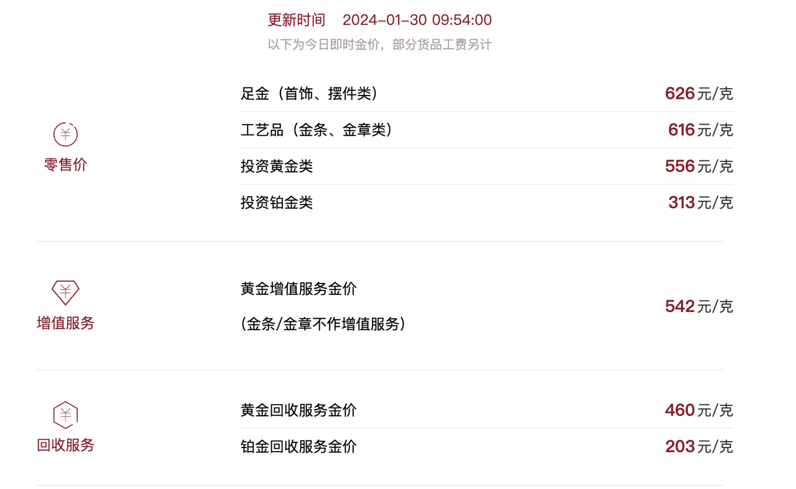
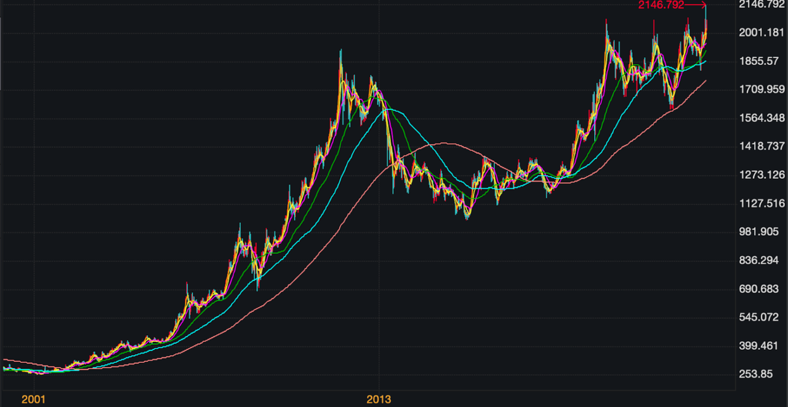

# 播客笔记

1. **作为商品形态，黄金是不适合做投资的。**黄金饰品的价格包括了它的**加工费、设计费、店铺租金、销售人员的工资**等。而当这些饰品被回收时，所有的**损耗**都会变成**价差**。
   图中的足金类产品为例，也就是首饰、摆件一类，它的零售价超过 600 元/克，但是回收服务价格只有约 400 元/克。**这中间足足差了 200 多元，也就是 30% 多的损失，**这就是黄金饰品的损耗。
2. **金店里卖的金条，在同样的重量下，其实比银行卖得更贵。**
3. **多数银行只回收自己的金条。**因为每家银行发行的金条也不一样，在成色、做工、重量上都会有一些细微的差异。所以，如果你买了招商银行的金条，想拿到农业银行去回收，大概率是行不通的。
4. 对于普通投资人来讲，投资黄金比较适合的渠道有以下三个：**纸黄金、黄金期货，以及黄金 ETF 基金**（Exchange-traded fund ，交易型开放式指数基金）**。**
   1. 我通过银行的 App 买了**纸黄金**后，并不直接持有黄金，而是银行代替我们持有。所以我们拿在手上的是一张纸，一个黄金的**交易凭证**。金价上涨后，我们可以用更高的价格把这张交易凭证卖掉。可惜的是，银行目前已经**基本暂停发行**纸黄金了。因为在历史交易中，出现过一些投资纸黄金的风险事件，导致不少投资人亏损。出于风控原因，银行暂停了纸黄金的交易，但我不确定在未来某个时间点它会不会被重启。
   2. 期货和股票交易的方法类似，都是在一个**集中的交易市场中交易**，比如国内比较大的是上海期货交易所。期货交易所中有专门的**黄金期货**，而且每天都有价格可供参考。交易黄金期货的时候，你买卖一手——也就是每一次交易的**最低限额——就相当于 1 千克黄金**。**举个例子，如果金价是 400 元/克，那么买卖一手你就需要花费 40 万元。**
   3.  **ETF，是指在股票市场上能够交易的指数基金的统称。**这种投资渠道的便利性就在于，一方面**交易的金额可以很小，**一两百、几千、几十万都可以；另一方面**有公开的价格，**一目了然，而且没有任何的人为损耗。

5. 黄金有两个特点：**第一，它的价格在短期内的波动非常难以预测。第二，黄金价格的变化周期非常长，远比股票市场的股价周期要长。**

# 番外03 买黄金避险？你得先了解其中的风险

大家好，我是玖洲，欢迎回到「不止金钱」的番外节目。

春节期间我在看评论区留言时，看到一些关于黄金投资的问题，这也引起了我的共鸣。不单是节假日能看到黄金首饰门店挤满了人，我身边的一些朋友也在讨论黄金作为避险资产的投资价值。去年上海期货交易所的黄金价格涨了近 18%，创下历史新高。而每当海外发生冲突时，金价也嗖嗖嗖往上涨，都引起了不少关注。似乎投资黄金已经成为我们这个时代规避风险的标准配置。

今天我想和大家聊一聊，黄金虽然美好，但是买黄金并不像我们想象的那样简单粗暴、买了就能避险，如果买错了，反而会成为风险。

# 金饰金条：好买不好卖

**首先，黄金不能瞎买，不少投资方向缺少投资价值。**我记得 2013 年媒体报道「中国大妈打败了华尔街精英」，怎么打败的呢？就是靠买黄金。2013 年其实是黄金的大「熊市」，伦敦的金价一年跌了 28%，非常惨烈，整个华尔街对黄金都持看空的态度。但中国国内掀起了一股买黄金的热潮。

当时有很多大爷大妈，甚至是年轻人都跑到金店去抢黄金，导致一些金店断货，开始涨价。所以就有媒体借机炒作，说我们「打败了华尔街的黄金空头」。这种不恰当的对比是有误导性的。这些大爷大妈们买的黄金是作为**商品属性**的黄金，也就是我们能在金店里买到的黄金饰品，当然也可能包括一些黄金投资品。但我想说的是，**作为商品形态，黄金是不适合做投资的。**

**我们面对的第一个问题是很高的损耗。**这个损耗是指的什么呢？我们以黄金饰品为例，黄金饰品的价格包括了它的加工费、设计费、店铺租金、销售人员的工资等。而当这些饰品被回收时，所有的损耗都会变成价差。通过下面这张图，我们来看一下黄金零售价和回收价的价差。

这张图来自于某家著名的品牌黄金店。虽然是去年底的数据，但这一段时间变化不会很大。我们重点看一下图里标注的零售价和下面的回收服务价格。我们以图中的足金类产品为例，也就是首饰、摆件一类，它的零售价超过 600 元/克，但是回收服务价格只有约 400 元/克。这中间足足差了 200 多元，也就是 30% 多的损失，这就是黄金饰品的损耗。

如果你购买的是这一类的黄金商品，意味着你支付了**非常高的溢价。**当你想把这些商品再变回现金，就会因为承担这些溢价而损失部分本金。

**除了损耗，黄金饰品还有一个很大的问题，就是缺少公开交易的市场。**一般来讲，只有少数黄金珠宝的品牌商会回收自家的饰品，多数情况下会让你以旧换新，甚至有些干脆不回收。而对于其他品牌的饰品，几乎是一概不回收。也就是「谁家的孩子谁抱」，你只能去对应的门店。如果遇到不接受回收的情况，想把这件饰品变现就只能选择路边的典当铺，或者一些规模比较小的回收点。这种情况下折扣率非常高，损失就不仅仅是上面我们提到的 30% 的价差了。最后我们很有可能不仅享受不到黄金价格上涨的增值，还会损失不少本金。

所以黄金饰品作为商品形态是非常不适合做投资的，千万不要冲着保值增值去买这些东西。

可能大家会问，金条是不是会更好一些呢？是的，金条的损耗会小很多，储藏也方便，甚至可以藏在枕头下面。而且它还是一个「标准」的投资品。

我们购买金条一般会通过银行、中国黄金公司这类官方渠道，还有一些珠宝品牌也会出售自己的金条。但这些不同的主体销售的金条都是一样的吗？答案是很模糊的，而且有争议。

理论上，金条就应该长得一模一样，不需要有差异。但实际上，不同品牌销售的金条加工环节也不同，在纯度上也会有一些细微的差异。如果你仔细观察，会发现一个有趣的现象：**金店里卖的金条，在同样的重量下，其实比银行卖得更贵。**如果我们回想一下上面提到的黄金饰品的损耗，你就明白了。同样的金条在不同品牌门店本身就带有了品牌溢价，还有门店的租金、人工费等成本也要均摊到金条的价格上。

看到这你可能会说：懂了，买银行的金条更好。但这里有一个小小的风险点：**多数银行只回收自己的金条。**因为每家银行发行的金条也不一样，在成色、做工、重量上都会有一些细微的差异。所以，如果你买了招商银行的金条，想拿到农业银行去回收，大概率是行不通的。

到这里我们就能总结出来了，金条和黄金饰品比起来，投资价值会更高一些，但同样也面临着一个问题——缺乏一个统一的、可以随时交易的公开市场。

# 普通人投资黄金的途径

既然我们明白了，以上投资黄金的途径并不是最好的，都存在不必要的损耗，有没有什么比较合适的渠道呢？在我看来，所谓的合适的渠道需要满足两个条件：**公开的交易市场，和公开的交易价格。**

基于这两个条件，我认为对于普通投资人来讲，投资黄金比较适合的渠道有以下三个：**纸黄金、黄金期货，以及黄金 ETF 基金**（Exchange-traded fund ，交易型开放式指数基金）**。**

我们先说第一种：纸黄金。从字面理解，纸黄金是黄金的代称。我们通过银行的 App 买了纸黄金后，并不直接持有黄金，而是银行代替我们持有。所以我们拿在手上的是一张纸，一个黄金的交易凭证。金价上涨后，我们可以用更高的价格把这张交易凭证卖掉。可惜的是，银行目前已经基本暂停发行纸黄金了。因为在历史交易中，出现过一些投资纸黄金的风险事件，导致不少投资人亏损。出于风控原因，银行暂停了纸黄金的交易，但我不确定在未来某个时间点它会不会被重启。

第二个途径是期货。简单来说，期货和股票交易的方法类似，都是在一个集中的交易市场中交易，比如国内比较大的是上海期货交易所。期货交易所中有专门的黄金期货，而且每天都有价格可供参考。但是对于我们个人投资者来讲，进入期货市场有一定的门槛。

首先，你需要有非常扎实的专业知识，因为**期货的交易难度比股票大很多，风险也要高很多。**其次，你**需要有比较大的资金体量，**它不像股票，几百块钱的价格也能交易。交易黄金期货的时候，你买卖一手——也就是每一次交易的最低限额——就相当于 1 千克黄金。举个例子，如果金价是 400 元/克，那么买卖一手你就需要花费 40 万元。也就是说，期货市场虽然大家都可以接触到，但它对于个人投资者来讲不是那么友好。

我们能考虑的第三个渠道是黄金类的 ETF 基金。所谓 ETF，是指在股票市场上能够交易的指数基金的统称。这种投资渠道的便利性就在于，一方面**交易的金额可以很小，**一两百、几千、几十万都可以；另一方面**有公开的价格，**一目了然，而且没有任何的人为损耗。

海外市场上一个很有名的黄金基金叫 SPDR，大家可以在任何一个炒股软件里搜一下这个基金，它背后持有的就是黄金的期货和现货，也就是我们刚才提到的第二个渠道——黄金期货交易所里交易的黄金产品。当然，这是海外的基金，假如我们的钱出不了海怎么办呢？其实国内有很多公募基金也发行了类似的 ETF 产品。比如华安基金的黄金 ETF、易方达基金的黄金 ETF，都是类似的以黄金为代表的指数类基金产品，这些基金也是投资到黄金的现货和期货上。对于我们个人投资者来说，我们可以用少量资金买这些基金的份额，相当于间接实现了对黄金的投资。

这一类基金有两个好处：第一，它的流动性非常好，我们可以随时投资，也可以随时赎回，只需要放到二级市场上卖掉就可以。第二，它的投资金额很小，不同于买金条，可能起始金额就要十几二十万，几千块就可以实现对 ETF 基金的投资。

以上就是我总结下来相对比较适合个人投资者投资黄金的几个途径。不过在你入手黄金之前，我还是想提示一下：**黄金名义上叫做避险资产，但是它的价格波动风险并不小。**

而且也有非常厉害的投资人在黄金上吃了大亏，比如美国一位叫做保尔森的对冲基金经理。保尔森因为在 2008 年金融危机时做空美国市场而一战成名，赚了很多钱。但他在 2011 年至2018 年的这个长周期里，投资了很多黄金，是黄金的大多头，同时也在那一轮的黄金熊市中备受煎熬。直到熊市末期，他终于忍无可忍出局了。不过我们回过头来看，如果他再忍一忍，跨过 2018 年，黄金从 2019 年开始到今天，又进入了新一轮的上涨周期。尤其是在俄乌冲突后，黄金的上涨可以说是气势如虹。但是很可惜，保尔森并没能熬这么久。

# 投资黄金需要「慢」心态

所以，我们能看出黄金有两个特点：**第一，它的价格在短期内的波动非常难以预测。**我见过很多人试图理解黄金，找到很多参考指标，比如美国的实际利率等，来说明黄金价格会如何变化。但是黄金的属性太复杂了，它的波动几乎是受事件性冲击的影响，我们很难预测。我在下面这张图里给大家展示的，就是 2021 年至 2023 年底黄金价格的变化。

我们可以看出，几乎每隔一段时间，金价都会出现大幅波动，而且每一次黑天鹅事件的发生都会对黄金造成很大影响。所以，如果我们是抱着短期投机的心态，投资黄金的难度相当大。

**第二个特点是，黄金价格的变化周期非常长，远比股票市场的股价周期要长。**所以在投资黄金的时候，我们需要有比较大的耐心。下面这张图显示的是更长周期下的黄金价格变化。

我们来看看，假设我们运气不好，在 2011 年投了黄金，那么一直到 2018 年的 8 年时间里，它都处在下行周期中，这个漫长的下行周期会让你非常煎熬。所以投资黄金的时候，我们依旧要保持一个基本的认知，**不要认为金价永远在上涨，也不要因为听说黄金是避险资产，就把自己的身家全部投进去。**不然结果有可能是你躲掉了外面的风险，却遇到了黄金自身的风险。

我们对黄金的讨论就先到这里，总结一下：**黄金有价值，但是不能随意投。对于个人来说，黄金 ETF 或许是一个更合适的选择，但是永远不要以为黄金没有风险。**我们只有保护好自己，才能够「不止金钱」。

如果大家对黄金还有什么比较感兴趣的话题想要讨论，也欢迎在评论区里面留言，我们下期番外节目再见。