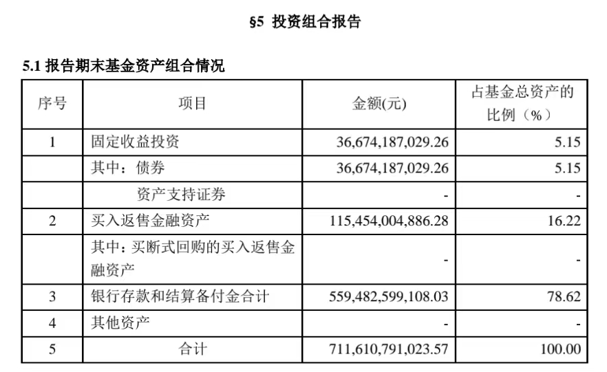
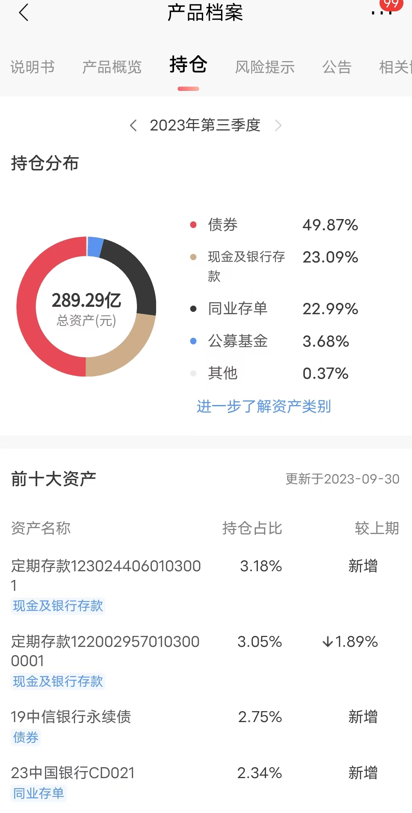

# 播客笔记

**一、低风险投资类别**

1. **货币基金**
   - **代表产品**：余额宝、零钱通等。
   - **投资方向**：78%资金为银行存款，5%投向短期债券（以余额宝2023年四季度为例）。
2. **银行理财（低风险类）**
   - **投资方向**：债券（49%）、现金/存款（23%）、同业存单（20%+，仅限金融机构存款）。
   - **代表产品**：招商银行「半年宝」等，收益率约3%+。
3. **债券类基金**
   - **特点**：固定收益类产品，收益潜力高于前两者，需承受小幅波动。

------

**二、货币基金 vs 银行理财**

| **维度**     | **货币基金**         | **银行理财**               |
| ------------ | -------------------- | -------------------------- |
| **风险偏好** | 更低（80%+银行存款） | 略高（更多债券/票据配置）  |
| **流动性**   | 随时赎回             | 部分有固定期限（3-12个月） |
| **收益率**   | <2%                  | >3%                        |

------

**三、资金配置建议**

1. **短期流动性（30%）**
   - **工具**：货币基金（如余额宝）。
   - **用途**：应急资金，随时可赎回。
2. **中长期配置（70%）**
   - 50%：固定期限银行理财。选择3/6/12个月等期限，明确资金回笼时间。
   - 50%：债券类基金。如纯债基金，博取略高收益。

------

**四、产品选择要点**

- **历史业绩**：优先选成立时间长、管理团队稳定的产品。
- **风险应对**：短期亏损（<5%）无需恐慌，避免频繁操作。

**核心逻辑**：平衡流动性与收益，低风险≠无风险，合理分散配置。

# 番外04 手里钱不多，如何投资风险低？（上）

大家好，我是玖洲，欢迎来到「不止金钱」系列的番外节目。

从最近听众的留言中，我看到一些很贴近大家日常投资需求的实操问题。比如：我只有一点钱，也刚接触投资不久，不敢做风险太高的投资；或者，我的钱不是长期的闲钱，只能投一年半年，这时应该怎么投？

其实这些问题都是在问，如果我想为手中富余的资金找一些风险低的投资方向，应该怎么做？**低风险**就是这里的关键词。

从投资配置的角度讲，无论是刚接触投资的新手，还是有丰富经验的老手，都需要留下相应比例的资金投在低风险、高流动性的地方，以备不时之需。尤其是对于新手来说，我建议这个比例还要高一点，甚至百分之七八十都不为过。这样在投资初期，我们就可以尽量少的暴露在高风险的投资里。

所以，有哪些低风险的类别是我们可以去看的呢？

我总结有 3 类。

**第一类是货币基金**，这是最具代表性的。包括我们日常接触到的余额宝，还有微信钱包里面的零钱宝。

**第二类是一部分银行理财。**请注意，我这里说的是一部分，并不是所有。

**第三类是固定收益类的产品。**主要是指债券类的基金。

这一集我们先聊前两类。

# 低风险，不等于没有风险

首先我想纠正一个普遍存在的误解，就是低风险经常被当作没有风险。

前几天，我在声动活泼的办公室碰到一位小伙伴。他告诉我，自己是个极其厌恶风险的人，所以他根本不做投资，把所有的钱都买成了余额宝，再加一些银行理财。

这个观点很有意思，为什么呢？第一，他根本没有意识到，当他购买这些产品时，其实已经在做投资了。第二，虽然他很厌恶风险，但是他把这些理财方式当成了完全无风险的东西。我们依次分析一下。

首先我们来看货币基金，包括余额宝、零钱宝这类产品。我们之前曾提到，货币基金其实就是我们把钱投给了货币基金的管理人，管理人再用这些钱购买一些低风险的银行存款和商业票据，包括少部分债券。这些投资方向流动性非常好，同时风险也比较低，但是它们的收益回报也相对有限。我们用余额宝来举个例子。

*余额宝 2023 年 4 季度基金报告截图*

这张图是余额宝 2023 年 4 季度的基金报告，大家在网上或是余额宝的 App 里面都能查到。其中有一个部分叫做投资组合报告，我们可以看到，这个投资组合报告详细拆分了余额宝把资金都投在了什么地方。在这一季的报告里，余额宝 78% 的资金放在了银行当存款。

你可能要问，为什么我们不干脆自己去存银行呢？最大的区别是，余额宝的资金体量非常大，有上千亿规模。所以，它在跟银行谈判的时候，谈判力更强，相应获得的银行存款利率也会比个人高一点。

我们接着看这份报告。值得注意的是，在余额宝货币基金的投资组合中，有 5% 的资金投向了债券。我们曾在节目中提到，2008 年金融危机时，美国的货币基金曾出现 3% 的短暂亏损，这就是因为其当时持有了已经倒闭的雷曼兄弟的商业票据。简单理解，可以把商业票据当作债券凭证的一种。所以你就能明白，为什么我说货币基金也是有风险的了。

那这种事情是不是离我们特别遥远呢？其实并不远。在 2005 年、2006 年的时候，国内就出现过一次货币基金收益率普遍变成负数的情况。负数的意思就是我们持有的货基已经开始亏钱了。当然，因为当时的监管介入非常及时，发行这些货币基金的大型公募都用自己的钱弥补了亏损，有惊无险地度过了危机。

从这个角度看，**货币基金并不是天然的、完全无风险的东西**。不过我们刚才提到的这种属于极端事件，发生的概率也比较小。在大多数的情况下，我们并不用过度担忧。从历史上已经发生过的风险事件来看，大型的货币基金管理人相对比较成熟，有比较及时的风控措施以应对货币市场发生的变化。

这种高流动性的货币基金，我认为很适合把一些短期的钱放进去。比如你两三个月都不需要用到的钱，又或者你拿不准什么时候要用，可能随时需要赎回，而且你要求的利率也低一些。在这种情况下，货币基金是非常合适的。尽管目前很多货基的年化收益率都不到 2%，听起来非常低。但是聊胜于无，总比放在手上当现金好。

# 银行理财并非「保险箱」

下面我们再来看一下银行理财。银行理财其实也是大家能想到的常见的低风险投资产品，但是这里面的猫腻就多一些了。

其实理财亏损的案例并不遥远，比货币基金亏损离我们还要再近一点。最近有代表性的一次就发生在 2022 年的 11、 12 月份，当时银行理财出现了大面积、普遍性下跌，甚至一些号称低风险的银行理财一个月的下跌幅度，也能达到 3%、4%。

如果我们再用「银行」「理财」「亏损」这几个关键词搜索一下新闻，能看到的内容就更多了。所以如果你把全部的钱都用于银行理财，还真不代表可以高枕无忧了。

那么银行理财的风险是怎么来的呢？

我们需要先明白一点，**银行理财跟货币基金本质上是很相似的**。从投资的方向上看，两者都是把我们的钱打包在一起，去买一些短期的债券、票据还有存款。其中大部分投资是属于风险低、流动性好的，那二者的区别在哪儿呢？

货币基金因为风险偏好更低，所以可能会购买更多的银行存款。就像我们刚才提到的，余额宝接近 80% 的资金都是存款。银行理财的风险偏好略高一点，所以银行买的存款就会更少，会更多配置一些债券和票据。这也就是为什么，银行理财的收益率普遍能够超过 3%，而货币基金只有不到 2%。

这里我任意选择一款银行理财。比如我现在手机 App 里招商银行 6 个月的理财，名字叫「半年宝」，也就是购买满 6 个月以后就可以赎回。这个理财的年化收益率大概是 3.3%，在产品详情的页面里面，我们是能找到具体的持仓的。比如以下这张图显示的就是去年 3 季度末的持仓数据，还是很一目了然的。

*招商银行「半年宝」2023 年 3 季度的持仓数据截图*

可以看到，在这款理财的投资方向中，49% 投资在债券上，23% 是现金和银行存款，另外还有 20% 多是买了同业存单。同业存单是什么东西呢？简单来说，它也是一种银行存款，只不过这种存款只能金融机构来存，我们个人不行。所以这款银行理财差不多一半的资金是投在了债券上，还有一半是投到了银行存款上。这也就是风险偏好稍微高一点，能获得的收益率也略高一点的原因。

总结一下，银行发行的低风险的理财产品，其实它可以当做是货币基金的升级版本。**它们投资了更多的债券，所以有更好的年化收益。但也正因为如此，在债券市场下跌的时候，银行理财受到的冲击也会更大。**这一点就是它们风险的来源。

那接下来就要问我们自己这个问题了，这个风险值得我们担忧吗？**对于明确标明了低风险等级的银行理财，我认为不需要过度担忧。**只是大家要有一个心理预期，这里面是有风险的，并且可能会出现阶段性亏损，亏损一般在 5% 的幅度以内。所以，遇到亏损不要慌张，而是需要我们去评估一下。**只要不是系统性的金融崩溃，银行持有的低风险债券一般都会反弹回去。**

就像 22 年 11 月底的这一波理财大跌一样，如果我们再往后放长一年的周期来看，绝大部分的银行理财都收复了当时的下跌，并且收益率还创了新高。但是我记得当时下跌的时刻，持有人是非常恐慌的，银行也遇到了大规模的理财赎回潮。

# 银行理财产品怎么挑

既然不需要过度担忧，那么我们在做银行理财选择的时候，有没有什么比较好的筛选方法呢？

从我个人的角度看，我倾向于去找那种**成立时间相对较长的低风险产品**。比如有好几年的历史，背后管理团队的管理时间也稍微长一点，投资风格也相对稳定一些。并且，时间长的产品对于我们来说有一个好处，就是能从数据上看到其历史业绩的全貌。

这一点在之前的节目里也跟大家分享过，**看到全貌非常重要。**如果历史上出现过非常大幅度的下跌，我大概率会规避这个产品，因为它很有可能在风控上是有瑕疵的。所以对于一些刚成立几个月的理财，尽管短期来看业绩非常好，但如果看不到足够长的历史表现，我是缺乏信任度的。

这背后还有另外一个考量，就是每一家银行一定会有一个核心产品系列，这种产品的成立时间一般都是最长的，持有人数量也是最多的。我们可以从这个角度思考，持有人数量越多，银行越重视，当然就越不希望这个产品系列出现风险。

再补充一点，**有一类的银行理财，我建议没有投资经验的朋友们最好不要碰，那就是标注了中等或者中高风险级别的银行理财**。有的银行会用数字来标记这个级别，比如招商银行，它标记的就是 R3、 R4 风险级别。大家在看银行理财产品说明的时候，一定要关注它的风险等级是多少。这种类型的理财通常会把比较大比例的资金投到股票上，或者投到一些权益类的资产上。

这倒不是说股票的风险太高了，所以不能碰。而是因为在我的观察和认知中，大多数银行理财的团队不具备投资高风险股票的能力，一旦涉及到更多的股票投资占比，这种理财的波动性就非常大了。如果去年大家买过银行发行的养老基金产品，肯定是深有体会，因为很多都在股票权益上出现了明显亏损。

我并不是否认银行中有很多优秀的股票投资经理。只是在更大的范围内，因为激励体制的不同，银行很难留住优秀的股票投资人才。所以如果银行在这一方面做得不好，也并不是一件很意外的事。

当然，银行肯定也明白这个现状，所以越来越多的银行把自己的理财资金委托给第三方的股票投资机构来管理。这就是一个相对比较尴尬的局面了，既然银行也是委托别人来做股票头寸的管理，那我们又何必把钱再投给银行，让银行再委托别人来做呢？

我们再来讨论最后一个问题，有没有一个公认的最佳投资配置比例？比如我有 50 万，那我应该全买银行理财，还是应该怎么投资？

我认为，并没有这么一个最佳配置比例，因为每个人的情况都不一样，因人而异。但我有一个大原则上的建议，这个建议仅仅是针对低风险投资的，不包括股票投资的群体。

我觉得 **30% 的资金可以放在随时能够赎回、流动性非常好的货币基金中。**这样，一旦遇到短期要用钱的场景，就可以随时取出来。**剩下 70% 的资金，**我会把**一半投资在有固定期限的银行理财上**，比如是 3 个月、 6 个月，还是 12 个月，这样我可以非常明确地预期到，这笔钱什么时候能够回到我账上。**剩下的另一半，**我会把它**投资到其他固定收益类的产品上，**博取稍微更高一点的收益，典型的就是债券类基金。这样搭配，我基本能够平衡短期用钱的需要，以及中长期较高收益的需要。

这里我们提到了固定收益类产品。这一类产品更具迷惑性一些，听起来似乎收益是固定的，是不是真的风险很低呢？我们在这打个问号。严格来说，这里面还包括一些风险比较高的投资方向，很容易踩坑。在下一期的番外中，我会和大家详细聊一聊，固定收益类产品投资到底怎么投更安全。

如果大家有任何疑问，也欢迎在评论区留言，我们下期番外节目再见。