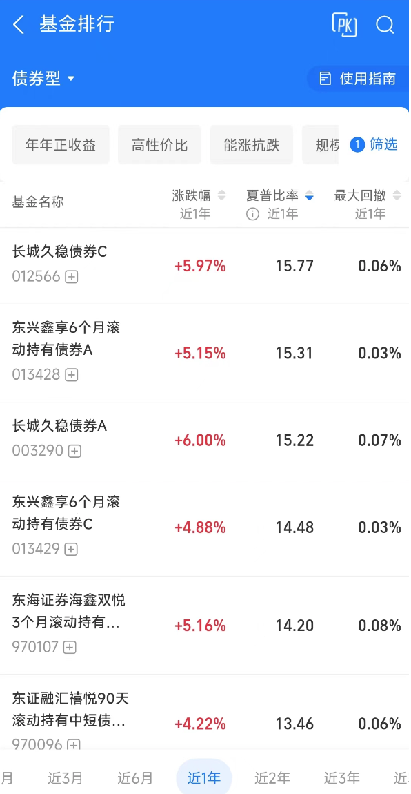
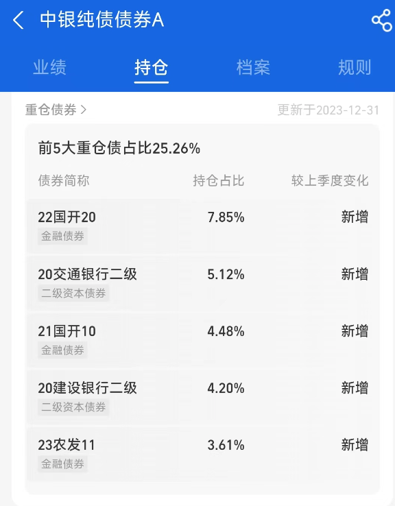

# 播客笔记

1. 比如有些**房地产公司的债券就违约**了，最后投资者一分钱都拿不到，与之相应的固定收益产品也会出现收益变化。
2. 第一，这些债券基金都有**封闭期的差异**。有的债基是买了一段时间之后才能够赎回，比如它的封闭期可能是一个月、3 个月或 6 个月。这和银行理财有些类似，只有等到封闭期结束，才能把钱取出来。这一点很重要，对于短期要用钱的人来说，一定要看清楚条款，不是所有的债券基金都能满足你的流动性需要。
3. 第二，这些债基**底层的资产略有差异**。意思就是每支债券基金投资的债券种类不一样。这个数据在哪儿能看到呢？一般在销售这些基金的软件里面都会有「基金持仓」这个栏目，在这里能看到细项。如果找不到这个栏目的话，那可以直接去这支基金的官网上查看基金公告，每个季度基金都会发布季度报告，里面会明确写出这支基金具体持有什么样的债券。
4. **中央政府和大型国资金融机构发行的债券，风险相对比较低。如果是企业公司发行的债券，风险就会更高**。
5. 「可转债」就是**「可转换债券」**的简称。它是一种特殊的债券，在一定的条件下，这些债券可以转化成发行方的股票。这样说你就懂了，它是**可以变成股票**的，所以它的收益比普通的债券确实高一些，但相应风险也同样会被股票的风险所传导。
6. 如果是稳健一点的债券，比如以国债为代表的，那 3% 到 5% 的年化收益率，是比较正常的。如果遇到今年一季度这样的债券牛市，那么年化收益率可能会更高一些。对于我来说，如果一支债券基金的年化收益率超过 10%，那我就会非常谨慎了，说不定我很早就已经止盈了。因为随着债券价格疯狂上涨，一定会有波动性加大的风险。
7. 至于投资多少比例比较合适，我还是按照一般性的资产配置的原则，**同一种资产不超过资金占比的 30%**。这完全是出于风险控制的考虑，假如我现在有 100 万，我就想全部投资到低风险的地方，那我投资的债券类基金或债券 ETF肯定不超过 30 万。剩下的钱，我可能用 30% 投资银行理财，40% 投资货币基金。再剩下的一点钱，可能就拿来做灵活配置了，看什么东西跌得多，就补一下仓。在这种比例下，我们就可以同时兼顾短期用钱和中长期收益的需求。

# 番外05 手里钱不多，如何投资风险低？（下）

大家好，我是玖洲，欢迎来到「不止金钱」系列的番外节目。

上一期番外节目里，我们讨论了有一点钱如何做低风险投资，以及这些投资的底层资产是什么。我把它们总结为 3 类。一类是以余额宝为代表的货币基金，一类是部分银行理财，还有第三类，也就是固定收益类产品。这种产品种类非常多，也比较复杂。但通常我们最容易接触到的就是债券类基金，也是门槛相对比较低的种类。

我们今天的讨论聚焦债券类基金。债券类基金通常被套在「固定收益」这个大名词下。其实这个名字有很大的迷惑性，大家千万不要被名字给骗了，以为真的有固定收益，其实并不是。**固定收益只是一个称呼，**它不等于银行存款，在很多时候它的收益不是固定的。如果我们去看合同，上面应该写着**预期收益率**，或者干脆写的就是**历史收益率**。也就是说，**所谓「固定」，并不保证一定会实现。**

为什么呢？因为这种产品的投资方向主要是债券，债券的价格是浮动的，甚至债券也是可能违约的。比如有些房地产公司的债券就违约了，最后投资者一分钱都拿不到，与之相应的固定收益产品也会出现收益变化。

严格来讲，这种投资应该属于中等风险到中低风险的。但我们也可以把其中风险比较低的投资方向挑出来，作为我们低风险配置的投资方向之一。

我们回到最有代表性的债券基金上。一般我们打开一个基金产品的首页分类，我们至少能够看到三个大类，**股票基金、指数基金，还有债券型基金**。对于这种债券型基金，大家通常会有一些困惑。第一，它的数量太多，容易看花眼；第二，有没有比较简单的投资方法；第三，怎么合理预期投资中的风险，应该配置多少。

针对这 3 个问题，我们接下来分别讨论一下。

# 什么是债券基金

首先，债券基金的数量确实非常多，必然会让我们看花眼。我现在手上有一个去年 12 月底的数据：全市场有近 6000 支债券基金产品，合计规模超过 8 万亿元。

债券基金这 4 个字非常简单，但它竟然包括几千支不同的产品。它们真的有很大差异吗？

我随手在支付宝的基金页面里截了一张图，大家可以直观看到，债券投资并不比股票基金的投资更简单。

*支付宝债券型基金页面截图*

在这张图里，大家能看到好几种不同的债券基金。我从我的经验给大家总结一下，我们应该关注的差异点是什么。

第一，这些债券基金都有**封闭期的差异**。有的债基是买了一段时间之后才能够赎回，比如它的封闭期可能是一个月、3 个月或 6 个月。这和银行理财有些类似，只有等到封闭期结束，才能把钱取出来。这一点很重要，对于短期要用钱的人来说，一定要看清楚条款，不是所有的债券基金都能满足你的流动性需要。

第二，这些债基**底层的资产略有差异**。意思就是每支债券基金投资的债券种类不一样。这个数据在哪儿能看到呢？一般在销售这些基金的软件里面都会有「基金持仓」这个栏目，在这里能看到细项。如果找不到这个栏目的话，那可以直接去这支基金的官网上查看基金公告，每个季度基金都会发布季度报告，里面会明确写出这支基金具体持有什么样的债券。

这里我以随意挑选的一支债基作为例子（不作为任何推荐，大家只当一个案例来看）。这支「中银纯债」的债基，最主要投资的是国家开发银行和其他几家大型国有银行发行的债券。

*「中银纯债」的债基截图*

如果你对债券不那么熟悉，也不用去搞懂这些底层债券到底是什么。只需要记住一个要点，**中央政府和大型国资金融机构发行的债券，风险相对比较低。如果是企业公司发行的债券，风险就会更高**。

当然，如果是地方政府发行的，或者说是地方的城投公司发行的债券，那风险就真的有点说不清了。有的人认为地方城投公司根本还不了那么多债，有的人认为政府一定会出来兜底。我们先尽量避开这些有争议的东西，省一点精力。

如果你看中的这支债券基金收益率特别高，高到你都觉得心花怒放了。这时候，我建议还是要多个心眼，去看一看它底层持仓的资产到底是什么，再来决定你要不要去承担其中的风险。

除了底层资产和封闭期的差异之外，还有一类债券基金，大家一定要非常注意。它其实更像是股票基金，在它的名字里一般都会出现**「可转债」**三个字。「可转债」就是「可转换债券」的简称。它是一种特殊的债券，在一定的条件下，这些债券可以转化成发行方的股票。这样说你就懂了，它是可以变成股票的，所以它的收益比普通的债券确实高一些，但相应风险也同样会被股票的风险所传导。

我们今天讨论的是一些风险较低的投资方向，所以这一类「可转债」的债券基金我建议暂时就不要去碰了。

# **债券 ETF，**简化投资决策的「捷径」

我们再来看第二点，如何做出债券上的投资决策？

因为很多人并不是债券专业人士，肯定也不会花那么多时间去选债基。那到底用什么简单的筛选方法，能够让我们承受的风险稍微低一点呢？

答案是**债券类的 ETF**。

债券 ETF 与 股票 ETF，也就是股票指数基金类似，简单来说，就是把同一个类型的债券打包在一起，做成一个指数。作为投资人，我们可以直接买卖这个债券类的指数基金，这样就分散了单一债券的风险。同时，债券 ETF 又做了归类，我们就可以直接去找不同归类里风险最低的一类。

我给大家一个数据，在 2023 年年底，全市场的债券 ETF 一共有 19 支。这样我们的筛选范围就从 6000 多支债券，缩小到了 19 支不同种类的债券 ETF，筛选难度就降低了。这些 ETF 中比较有代表性的有国债 ETF、地方债 ETF，当然还有城投债 ETF、公司债 ETF，等等。

这种投资标的最大的好处，就是同一类资产打包成指数基金，我们在选择的时候会非常明确我们投的是什么。既然我们要找低风险的投资方向，那我建议就直接看**国债 ETF** 就好了。因为它以我们中央政府发行的债券作为主要投资方向，这一类产品的风险在债券里相对是最低的。

我还是用具体的产品来举例。比如一支代码为 511010 的国债 ETF「上证 5 年期国债 ETF」，它持仓的主要是我们国家 5 年期的债券。还有一支基金叫「30 年期国债 ETF」，它的代码是 511090。和 5 年期国债相比，它投资的国债期限更长一些，当然最近的表现也会好一些。简单来说，就是**债券的期限越长，价格波动的弹性越大。**所以在上涨的时候， 30 年期的国债就会比 5 年期的表现更好。反过来下跌的时候也是这样。这两支是非常典型的、以投资国债为主的债券指数类基金。

话说回来，如果你的风险偏好再高一点，那投资公司债的 ETF 到底行不行？

我也不能说不好，不过我们可以看一下，有一支公司债 ETF 的代码是 511030，大家看它的历史表现就会发现，2022 年底的波动是非常的大的。如果我们忍受不了这么大幅的波动，那目标就很明确了，就找低风险的。简单选择，就是直接看国债类 ETF。至少，我不认为国家是有违约风险的。其次，国债的波动性也相对小一些，虽然它的收益率低一点，但是国债 ETF 的流动性非常好，随时可以买卖，也可以赎回，能够满足我突发用钱的需要。

# 风险与收益的平衡

现在，我们把债券基金投资的大范围，逐步缩小到了债券 ETF 指数基金，也明确了低风险的投资目标。那我们应该如何合理预期投资中的风险，以及我们的配置比例应该是多少呢？

**国债的投资风险主要还是利率变化的风险。**有一个简单的公式，大家只要知晓就可以了。**利率下降，国债价格上涨；反之，它就会下跌。**所以，哪怕是国家发行的债券在二级市场交易的时候，也会有价格波动。

对于我们普通投资人来说，尤其是当国债涨的特别快的时候，我们看到国债的 ETF 基金的收益越来越高，就要意识到，它回撤的风险其实也是在加大的。这种时候，我们可以稍微谨慎一点，就跟投资股票一样，不要用太多的资金去追高。换句话说，**债券类的 ETF 也是适合做定投的**，我们不要做一锤子买卖。毕竟债券基金不是银行理财，它的波动性还是会相对大一些。

那么对于这种债券基金，我们应该怎么去预期它的合理收益率呢？

如果是稳健一点的债券，比如以国债为代表的，那 3% 到 5% 的年化收益率，是比较正常的。如果遇到今年一季度这样的债券牛市，那么年化收益率可能会更高一些。对于我来说，如果一支债券基金的年化收益率超过 10%，那我就会非常谨慎了，说不定我很早就已经止盈了。因为随着债券价格疯狂上涨，一定会有波动性加大的风险。

那至于投资多少比例比较合适，我还是按照一般性的资产配置的原则，**同一种资产不超过资金占比的 30%**。这完全是出于风险控制的考虑，假如我现在有 100 万，我就想全部投资到低风险的地方，那我投资的债券类基金或债券 ETF肯定不超过 30 万。剩下的钱，我可能用 30% 投资银行理财，40% 投资货币基金。再剩下的一点钱，可能就拿来做灵活配置了，看什么东西跌得多，就补一下仓。在这种比例下，我们就可以同时兼顾短期用钱和中长期收益的需求。

这两期番外节目，我们梳理了常用到的低风险投资方向，以及其中潜在的风险是什么。当然，低风险的投资选项还是有限的。如果大家想要争取更高的收益，可能就要涉及股票投资、股票基金投资，甚至海外市场的投资了。

如果大家对这些话题有感兴趣的点，也欢迎在评论区留言，我们下期番外节目再见。