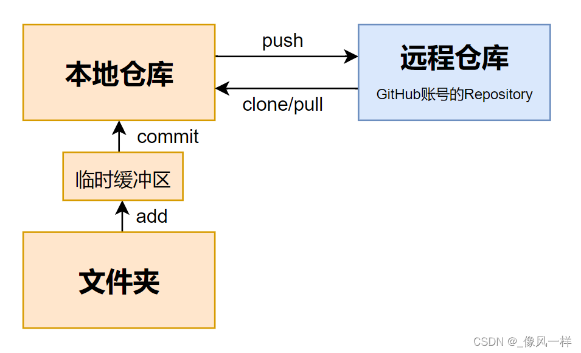

@[TOC](新手入门 Git & GitHub)
# ==零、命令行小抄==
> 本小抄适用于：远程仓库new了repo、本地有（要上传的）文件夹、SSH已绑定好
> 供有一定基础、但不常用的同学（包括我自己）查阅

1. `ssh-keygen -t rsa -C "12345678@qq.com"`，生成rsa（用于本地电脑和远程仓库绑定，详见下文3.3）
2. 进入要上传的文件夹，`git init` ，创建本地仓库
3. `git remote add origin git@github.com:xxx/yyy.git`，本地仓库连接远程仓库
4. 做完修改后，`git add .`，添加到临时缓冲区
5. `git commit -m "添加了/修改了..."`，提交到本地仓库
6. `git push -u origin master`，提交到远程仓库的master分支
7. `git log`，查看已有的commitID（为7准备）
8.  `git reset --hard commitID`，撤销 commit、撤销 git add . 操作、撤销修改代码（在以下情况常用：（1）添加了一个怎么也传不上去的大文件；（2）push时候发生由于commit引起的不知名error）
9. `"ssh:connect to host github.com port 22: Connection timed out"`问题的解决
	首先，`vim ~/.ssh/config`
	其次，添加以下代码
	```
	# Default github user self
	Host github.com
		port 443 # 默认是22端口
		HostName ssh.github.com
		IdentityFile ~/.ssh/id_rsa
	```
	最后，`:wq`保存并退出vim模式

# ==一、前言==
**学习Git**真的是我学习路上的一道“**槛**”；
&emsp;&emsp;一方面，不断接触的信息告诉我“**学习Git很重要**”；
&emsp;&emsp;另一方面，每次找到的教程都有那么几步**看不懂**，或是**看懂了记不住**。

> 我前前后后学了三四次了， 
> 或被GitHub英文劝退， （不会翻墙的时候打开还会很慢）
> 或因安装软件繁琐放弃， （啥是Git？？啥是Github？？）
> 或成功按部就班实现了一次demo，但没有实践下去于是忘了

谨以此篇献给想学习并且在学习**Git版本控制**的小白。
&nbsp;
# ==二、原理描述==
## 2.1 四句话讲明白
**Git** 狭义上来说是一个版本控制软件，广义上简单理解成`代码的仓库`；
**GitHub** 一个远程仓库，白话就是`程序员专用的“某度网盘”`；
**网盘会用吧？** 从本地的一个文件夹`上传`到网盘，或从网盘`下载`到本地。
**Git你就会了。** 从本地仓库（repository）`上传（push）`到远程仓库，或从远程仓库`下载（pull）`到本地。
&nbsp;
## 2.2 补充说明
### （1）本地仓库
1. 电脑上的一个文件夹就是一个本地仓库
2. 只是文件夹当然不行（就像没名没证空有房屋和物资，别人怎么知道是仓库）
3. 下载Git后可以在文件夹下通过命令行输入命令建立仓库（告诉别人，我这个文件夹，是仓库）
### （2）远程仓库
1. GitHub就是一个远程仓库
2. 一个GitHub账号对应一个专属于你的仓库
3. 也许你访问GitHub官网会很慢（这需要花点小费翻墙解决）
4. 也许你读不懂英文，但我相信你可以磕磕碰碰注册成功！
### （3）相互绑定
1. 有了本地和远程仓库还不够（远程仓库怎么知道该不该接收呢，我不认识你）
2. 我们需要一个SSH安全协议（远程仓库把该本地仓库的名字加入联系人名单，可以接收）
### （4）上传下载
1. 一般该操作在本地仓库进行
2. 我们通过Git提供的命令行命令实现push和pull
3. 远程仓库有时也需要做一些操作（仓库收到物资后也需要整理的嘛）
4. 即对别人提交的修改更新做审核和合并（初学我们不涉及）
&nbsp;
# ==三、保姆教程==
我将对步骤进行概述性描述，因为有一位大佬已经发过知乎，
我觉得写的很好，也不多赘述，各位循着我的大纲去他那亲自体验就好~
（链接我放评论区，欢迎大家去瞅瞅！真的很棒很棒！）
## 3.1 本地仓库（Git）
（1）下载安装git提供命令行工具  `[对应知乎文章 第六点]`
（2）一个文件夹demo做本地仓库（这个不用教吧？？新建文件夹即可）
## 3.2 远程仓库（GitHub）
（1）如有需要，付费翻墙（白话就是，通过歪果的节点上外网，没有阻碍速度更快）
（2）一个GitHub注册账号 `[对应知乎文章 第二点]`
（3）新建一个远程仓库repository `[对应知乎文章中 第四点]`
## 3.3 相互绑定（SSH）
（1）在本地生成SSH key  `[对应知乎文章中 第八点]`
（2）向GitHub添加SSH key `[对应知乎文章中 第八点]`
## 3.4 上传下载（Git命令介绍）
（1）本地仓库的更新与整理 `[对应知乎文章中 第七点]`
（2）本地仓库通过Git命令行上传下载 `[对应知乎文章中 第九点]`
（3）远程仓库查看效果`[对应知乎文章中 第九点]`

# ==结语==
如果对你有帮助的话给个赞吧，顺带附一张自制的说明图~

